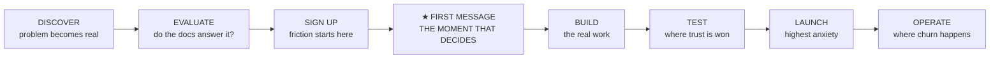
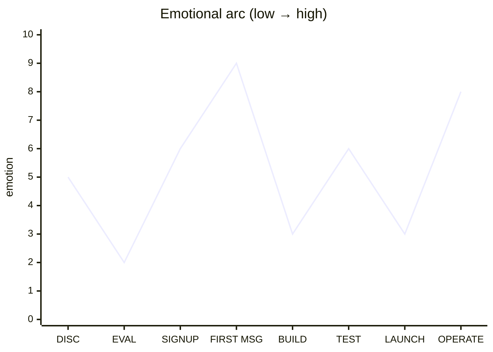
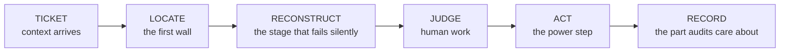
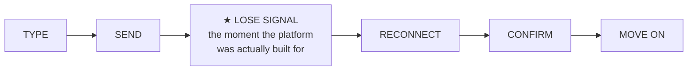

# Relay — Journey Map

Four journeys, in order of how directly the person touches Relay:

| Journey | Person | Relationship to Relay | What the journey reveals |
|---|---|---|---|
| 1 — Primary | **Mai**, integrating developer | Direct: signs up, integrates, operates | Where adoption is won or lost |
| 2 — Approval | **David**, engineering lead | Direct: approves, monitors | What blocks or unblocks purchase |
| 3 — Operational | **Priya**, support lead | Mediated: uses tools built *on* Relay | Which APIs must exist for her employer to serve her |
| 4 — End user | **Tuan**, delivery driver | Invisible: never knows Relay exists | The protocol requirements no one will ever ask for out loud |

Journeys 3 and 4 are unusual inclusions for an infrastructure product, and that is the
point: Relay's customers succeed only if *their* users succeed. Priya's and Tuan's journeys
are where most of the hard requirements in the SRS actually come from — tombstones, edit
history, idempotency keys, backfill-on-reconnect. Mapping their journeys is how those
requirements were found.

---

## Primary journey — Mai, from problem to production

Eight stages. The critical one is Stage 4: nearly all abandonment happens before the first
message is delivered.

**Emotional arc**

---

### Stage 1 — Discover

**Trigger:** the messaging requirement is committed to a roadmap, or her own prototype hits
a wall she recognises as a systems problem.

| | |
|---|---|
| **Doing** | Searching "chat API", "websocket chat scaling", "Stream alternative". Reading comparison posts. Asking in a developer community. |
| **Thinking** | *How much of this can I get away with building myself?* |
| **Feeling** | Cautiously optimistic — she has not yet priced anything |
| **Touchpoints** | Search results, docs site, comparison articles, GitHub |

**Pain points**
- Every vendor's homepage claims the same three things
- Marketing copy without a code sample tells her nothing

**Opportunities**
- Put a working code sample on the landing page, above the fold
- Publish an honest "when to build this yourself instead" page — it costs a few
  unqualified signups and buys considerable trust
- Make the docs public and indexable; they are the top of the funnel

**Measure:** docs visits from organic search · landing → docs click-through

---

### Stage 2 — Evaluate

The most under-served stage in this category. Mai is reading, not signing up.

| | |
|---|---|
| **Doing** | Reading the quickstart without running it. Checking the WebSocket protocol spec. Looking for reconnection and ordering guarantees. Skimming pricing. Checking the status page history. |
| **Thinking** | *Have these people actually run this in production?* |
| **Feeling** | Sceptical, scanning for reasons to eliminate |
| **Touchpoints** | Docs, API reference, pricing page, status page, changelog |

**Pain points**
- Quickstart requires signup before the code is visible
- Reconnection and ordering behaviour undocumented — the strongest negative signal available
- Pricing that requires her to guess three variables
- Missing error reference

**Opportunities**
- **Publish the entire API reference without authentication.** Nothing else in this stage matters as much.
- Document reconnection, ordering, and idempotency prominently and precisely
- A pricing calculator with concrete inputs: users, messages per user per day
- An architecture page explaining the operational/analytical split — it signals engineering seriousness to exactly the reader who is looking for it

**Measure:** docs → signup conversion · time on protocol pages · pricing calculator use

---

### Stage 3 — Sign up

Pure friction. Every step is a leak. The goal is to be forgettable.

| | |
|---|---|
| **Doing** | Creating an account, landing in a dashboard, hunting for an API key |
| **Thinking** | *Just give me the key.* |
| **Feeling** | Impatient |
| **Touchpoints** | Signup form, email verification, dashboard first-run |

**Pain points**
- Mandatory company size, role, phone number
- Email verification blocking key issuance
- Credit card before any usage
- Landing on a marketing dashboard instead of credentials

**Opportunities**
- GitHub or Google OAuth, nothing else required
- **A development-environment API key visible on the first screen after signup**
- Auto-create a default application and a dev environment; do not make her configure anything to try it
- Defer email verification until production keys are requested
- A free tier generous enough that a prototype never touches a limit

**Measure:** signup completion · time from account creation to key copied · % copying a key in the first session

---

### Stage 4 — First message ★

**The stage that decides everything.** Target: under ten minutes from key to a message
travelling between two browser tabs.

| | |
|---|---|
| **Doing** | Pasting the quickstart, installing the SDK, running it, opening two tabs, sending "test" |
| **Thinking** | *Please just work.* |
| **Feeling** | Tense concentration → sharp relief and delight on success, or immediate abandonment on failure |
| **Touchpoints** | Quickstart, SDK, dashboard live-events view, error responses |

**Pain points**
- Quickstart that does not run as written — instant credibility loss
- Unclear whether to authenticate with the API key or a user token; **this is the single most common failure and deserves its own explicit explanation**
- Silent WebSocket failure with no diagnostic
- No way to confirm the server received anything

**Opportunities**
- A copy-paste quickstart under twenty lines that runs unmodified
- A dev-mode token helper so she is not forced to build JWT signing before her first message
- **A live event stream in the dashboard** — she sees her connection appear and her message arrive. This converts anxiety into confidence faster than any documentation.
- Error responses that name the field and link to the relevant docs page
- An in-browser sandbox for people who want to test before installing anything

**Measure:** **% of signups reaching first message (target > 60%)** · **median time to first message (target < 10 min)** · error rate on first API call

---

### Stage 5 — Build

Days to weeks. Mai is integrating properly now, against her own UI and data model.

| | |
|---|---|
| **Doing** | Wiring her user IDs to Relay identities, implementing token minting on her backend, channel creation on entity creation, history pagination, presence, handling reconnection in her UI |
| **Thinking** | *How do I map my model onto theirs?* |
| **Feeling** | Focused, occasionally blocked, mostly productive |
| **Touchpoints** | SDK, API reference, dashboard, support channel |

**Pain points**
- Identity mapping is under-documented in most platforms — how her user IDs relate to platform users
- Token minting examples in one language she does not use
- Unclear channel modelling for her domain (one channel per shipment? per pair of users?)
- Missing TypeScript types
- No way to inspect what her code actually sent

**Opportunities**
- A **domain modelling guide** with three worked examples — marketplace, support desk, team collaboration
- Server-side token minting snippets in Node, Python, Go, and PHP
- Generated TypeScript types published with the SDK
- **A request log in the dashboard** showing every call with payload, status, and latency — the debugging tool that removes most support tickets, and a natural first consumer of the ClickHouse pipeline
- Webhook testing: replay, inspect, and a local forwarding CLI

**Measure:** time from first message to first webhook configured · support contacts per integration · request-log usage

---

### Stage 6 — Test

Where trust is either earned or quietly lost.

| | |
|---|---|
| **Doing** | Simulating network drops, testing reconnection and message ordering, load testing, verifying rate limit behaviour, checking webhook retries |
| **Thinking** | *What happens when this breaks at 2am?* |
| **Feeling** | Deliberately adversarial |
| **Touchpoints** | Dev environment, rate limit headers, status page, docs on failure modes |

**Pain points**
- No way to simulate failures — she has to break things by hand
- Rate limits that return `429` with no headers indicating remaining quota or reset time
- Undocumented retry behaviour, so she cannot tell a bug from a design decision
- Shared dev and production quotas, so load testing risks her live environment

**Opportunities**
- **Fully isolated dev and production environments with separate keys and separate quotas**
- Standard rate limit headers on every response: limit, remaining, reset
- A documented failure-modes page: what happens on disconnect, on duplicate send, on webhook timeout, on quota exhaustion
- A chaos endpoint in dev that forcibly disconnects a client so reconnection logic can be tested deliberately

**Measure:** dev-environment message volume before production key request · reconnection tests observed

---

### Stage 7 — Launch

Short, high-stakes, high-anxiety.

| | |
|---|---|
| **Doing** | Requesting production keys, entering billing details, deploying, watching the dashboard closely for the first hours |
| **Thinking** | *Is it working? Is it working right now?* |
| **Feeling** | Alert, exposed |
| **Touchpoints** | Dashboard, metrics, alerts, status page, support |

**Pain points**
- Production key issuance gated behind a delay or a sales conversation
- No real-time visibility during the critical first hours
- Discovering a production-only limit at the worst possible moment
- Cost uncertainty on day one

**Opportunities**
- **Self-serve production key issuance** — no gate, no call
- A launch-day dashboard view: live connections, message rate, error rate, delivery latency
- Configurable alerts on error rate and quota consumption
- Live cost projection from the first hour of real traffic, not at month end
- A pre-launch checklist in the docs

**Measure:** dev → production conversion · time from production key to first production message · first-week error rate

---

### Stage 8 — Operate

The longest stage, where retention is won or lost — and where nobody is paying attention
because nothing is on fire.

| | |
|---|---|
| **Doing** | Checking usage weekly, investigating occasional user reports, forecasting cost, upgrading the SDK, adding features |
| **Thinking** | *Is this still the right call?* |
| **Feeling** | Ideally, nothing at all |
| **Touchpoints** | Dashboard, invoices, changelog, status page, support |

**Pain points**
- Invoice arrives larger than expected with no explanation of what drove it
- No way to trace a specific user's reported problem
- Breaking SDK changes without a migration path
- Silence during incidents

**Opportunities**
- **Usage broken down by dimension — channel, application, day** — so a cost increase has an explanation attached. This is the core value of the analytics pipeline to the customer.
- Per-user and per-channel message tracing for support investigations
- Proactive alerts when usage deviates significantly from the trailing average
- Semantic versioning with a deprecation policy measured in months
- Incident communication within fifteen minutes, before resolution is known

**Measure:** 30/90-day application retention · dashboard sessions per active application · support tickets per thousand messages · usage growth per application

---

## Journey 2 — David's approval path

Runs alongside Mai's, typically triggered at the end of Stage 5. He can stop the project at
any point.

| Phase | What he does | Blocks on | What unblocks him |
|---|---|---|---|
| **Awareness** | Mai proposes buying rather than building | Nothing yet | A build-vs-buy cost comparison Mai can produce from the pricing calculator |
| **Diligence** | Reviews pricing, security, terms, incident history | Opaque metering; no uptime record | Public status history · security page · data retention and residency documentation |
| **Approval** | Signs off on spend | Unbounded cost exposure | Hard spending caps and quota alerts he can configure |
| **Oversight** | Checks cost monthly, is paged during incidents | Unexplained cost growth | Usage attribution by application and by team · honest incident communication |

**Design implication:** the analytics work in Phase 3 serves David at least as much as Mai.
Spending caps, usage attribution, and alerting are not dashboard decoration — they are the
features that get the purchase approved.

---

## Journey 3 — Priya resolves a dispute

Priya never touches Relay directly. She uses an internal support tool that Mai built on
Relay's moderation APIs in an afternoon — or she doesn't, if those APIs are incomplete, in
which case every step below becomes a ticket to the engineering team. **The quality of this
journey is a direct measure of the completeness of `FR-MOD` and the message history model.**

**Scenario:** a driver disputes a penalty, claiming the dispatcher never sent a delivery
address. A customer files a complaint about abusive messages in the same week. Both land in
Priya's queue on a Tuesday morning.

### Stage 1 — Ticket arrives

| | |
|---|---|
| **Doing** | Reading the complaint; extracting an order number, two user names, a rough date |
| **Thinking** | *Which conversation is this, and can I even see it?* |
| **Feeling** | Routine — this is the fourth one today |

**Pain points** — the ticket references *her company's* domain objects (order #88412), not
channels or user IDs. Someone has to translate.

**What Relay must provide** — customer-supplied external IDs on channels and users
(FR-USR-01, FR-CHN-01), so Mai's support tool can map order #88412 → channel
`order-88412` with zero lookup tables. This is why external IDs are P1 requirements: they
exist for Priya, not for elegance.

### Stage 2 — Locate the conversation

| | |
|---|---|
| **Doing** | Entering the order number into the internal tool; opening the channel |
| **Thinking** | *Please let this be the right thread* |
| **Feeling** | Fine if it takes seconds; escalating frustration if it takes an engineer |

**Pain points** — if lookup fails, the fallback is asking engineering to query the
database, which turns a 10-minute task into a 2-day one. On her previous employer's
homegrown system, this was the norm.

**What Relay must provide** — channel retrieval by external ID; a user's channel list
(FR-CHN-08) for the "I don't know the order number, but it was this driver" case.

**Measure (for the customer, enabled by Relay):** median time from ticket to conversation
open. Target: under one minute.

### Stage 3 — Reconstruct what happened ★

**The stage that decides whether the dispute is resolvable at all.** The driver says the
address never arrived. Three possibilities: it was never sent, it was sent and deleted, or
it was sent and edited afterwards. A history model that cannot distinguish these three is
useless for her purpose — and most homegrown chat systems cannot.

| | |
|---|---|
| **Doing** | Reading the full thread in order; checking timestamps; expanding edit history on a suspicious message; noting a deleted message tombstone at 14:32 |
| **Thinking** | *The dispatcher edited the address message eleven minutes after sending it. That's the whole case.* |
| **Feeling** | Confidence — the record is complete enough to be decisive |

**Pain points in inferior systems** — hard deletes leave no trace, so "there was never a
message" and "the message was removed" are indistinguishable. Edits overwrite in place, so
the original text is gone. Client-side timestamps make the sequence of events unprovable.

**What Relay must provide** — this stage is the justification for four SRS decisions:
- **Tombstones** (FR-MSG-08, FR-MSG-10): a deletion is visible *as a deletion*, in place, in order
- **Immutable edit history** (FR-MSG-07): every prior version, timestamped
- **Server-assigned sequence numbers** (FR-MSG-02/03): the order of events is a fact, not a claim
- **Complete history via API key** (FR-MOD-01): moderator access is not limited by membership

**Measure:** % of disputes resolvable from the record alone, without interviewing either party.

### Stage 4 — Judge

Human work; Relay's only job is to stay out of the way. The one product implication:
timestamps must be unambiguous (CON-04 — UTC, millisecond precision), because "14:32 in
whose timezone?" has decided real disputes badly.

### Stage 5 — Act

| | |
|---|---|
| **Doing** | Removing the abusive messages from the second ticket; restricting the sender pending review |
| **Thinking** | *This needs to be gone before the customer checks the thread again* |
| **Feeling** | Urgency — abuse visible for hours is a churn event and possibly a safety issue |

**Pain points** — in her previous job, content removal meant filing a ticket and waiting a
day. The abuse stayed visible the whole time.

**What Relay must provide** — moderator deletion of any message (FR-MOD-02), tenant-scoped
ban (FR-USR-06), both effective in real time: connected clients see the deletion event
immediately (FR-RTM-05), and a banned user's connections drop. **Latency of moderation is a
safety property, not a convenience.**

### Stage 6 — Record

| | |
|---|---|
| **Doing** | Writing up the resolution; noting which messages were removed and why |
| **Thinking** | *If this driver appeals, or if legal asks in six months, the trail has to hold* |
| **Feeling** | Careful — this is the part her own manager audits |

**What Relay must provide** — the immutable moderation audit log (FR-MOD-03): actor,
action, target, timestamp. When the deletion request under data-protection law arrives a
month later, the compliance erasure endpoint (FR-MOD-04) with its completion receipt is
what lets her close that ticket in minutes instead of escalating it.

**Journey summary — what Priya's Tuesday proves:** every requirement in `FR-MOD`, plus
tombstones, edit history, and external IDs, exists because of a concrete step in this
journey. If a proposed feature cut touches any of them, this is the journey that gets
re-read first.

---

## Journey 4 — Tuan's message, through a tunnel

Tuan's journey is measured in seconds, not weeks, and he takes it two hundred times a day.
He never sees Relay's name. His journey is mapped at the level of a *single message sent
under bad conditions*, because that is the unit at which the platform earns or loses his
trust — and with it, the customer's product reviews.

**Scenario:** Tuan is driving into an underground car park. The dispatcher has just asked
which entrance he's at. He types "B2, north ramp" and hits send as the signal dies.

### Stage 1 — Type and send

| | |
|---|---|
| **Doing** | Typing one-handed at a red light; tapping send |
| **Expecting** | The message appears in the thread instantly |
| **Feeling** | Nothing — and nothing is the goal |

**What Relay must provide** — optimistic local insertion with an honest `sending` state
(FR-SDK-05). The message appears immediately but is visually distinct from a delivered one.
Dishonest UIs that render unsent messages as sent are how "but I *did* send it" disputes
are manufactured — see Priya's Stage 3.

### Stage 2 — Lose signal ★

**The moment the platform was actually built for.** The send is in flight; the socket dies;
Tuan's phone shows one bar, then none. He glances at the screen: the message shows a clock
icon. He puts the phone down and keeps driving.

| | |
|---|---|
| **Doing** | Nothing — driving |
| **Expecting** | The app will sort itself out, because messaging apps always do |
| **Feeling** | Mild awareness at most; anxiety only if the state is ambiguous |

That expectation — *messaging apps always sort themselves out* — was set by consumer
messengers with hundred-person infrastructure teams. Tuan holds Mai's two-person team to
the same standard, which means Relay must meet it on their behalf.

**What Relay must provide**
- The SDK queues the outbound message locally (FR-SDK-07)
- The idempotency key was generated at send time, *before* the failure (FR-SDK-06) — so whatever happens next, retrying is safe
- No acknowledgment was received, so the state is honestly `sending`, not falsely `sent` (FR-MSG-05)

**The failure this prevents:** the naive implementation retries without an idempotency key
and the dispatcher receives "B2, north ramp" three times — or worse, the client assumes
failure when the server actually persisted it, and a manual resend duplicates it. Duplicate
and phantom messages are the #1 user-visible defect in homegrown chat. FR-MSG-04 exists
for this exact ten-second window.

### Stage 3 — Reconnect

Ninety seconds later, Tuan parks on B2 and his phone catches wifi.

| | |
|---|---|
| **Doing** | Still nothing — the phone is in his pocket |
| **Expecting** | — |
| **Feeling** | — |

The entire stage is invisible, and everything in it is load-bearing:

- The SDK reconnects with **backoff and jitter** (FR-SDK-04) — jitter matters because when
  the car park's wifi comes back, *forty drivers'* phones reconnect in the same second, and
  a thundering herd of synchronized retries is a self-inflicted outage
- It presents its **resume cursor**; the server backfills everything since (FR-RTM-03) —
  including the dispatcher's reply "ok, coming down", sent while Tuan was offline
- The queued "B2, north ramp" flushes **in order, with its original idempotency key**
  (FR-SDK-07, FR-MSG-04); the server either persists it or recognises the duplicate
- Sequence numbers put the conversation in the *correct* order — server order, not the
  scrambled order in which frames happened to arrive (FR-MSG-03)
- If Tuan had been offline through 600 messages of a busy fleet channel, backfill truncates
  and refetches instead of replaying the flood (FR-RTM-04)

**Design note — battery as a requirement.** A reconnect loop without backoff doesn't just
fail; it drains the battery of a person whose phone *is his livelihood*. NFR-PRF and
FR-SDK-04 are, for Tuan, ergonomic requirements about heat and battery, not just network
etiquette.

### Stage 4 — Confirm

| | |
|---|---|
| **Doing** | Glancing at the phone while walking to the lift |
| **Expecting** | His message shows sent; the dispatcher's reply is there; nothing is duplicated |
| **Feeling** | Nothing — which is the product working |

The clock icon is gone. One "B2, north ramp", marked sent. The reply sits *below* his
message because sequence numbers say so, even though it reached his phone first during
backfill.

### Stage 5 — Move on

Tuan pockets the phone. Total journey: ~2 minutes, zero conscious decisions, zero taps
beyond the original send.

**The asymmetry that defines this journey:** executed perfectly, it produces *no feeling at
all* — and no review, no ticket, no signal. Executed badly, it produces a duplicated
message, a lost address, a dispute in Priya's queue, and eventually a one-star review of
*the customer's app* that names "messages don't send" as the reason. Relay's failures are
always attributed to someone else's product. That is the deal infrastructure makes, and it
is why the reliability requirements (FR-MSG-06, NFR-REL-02) carry the priorities they do.

**Measure:** duplicate message rate (target: zero) · messages lost after acknowledgment
(target: zero) · reconnection success within 30 s of connectivity return · backfill
correctness under fault-injection tests — this journey, scripted, *is* the Phase 1 exit
criterion in the SRS (§7.3).

---

## Where to concentrate effort

Ranked by impact on adoption, based on where the journey leaks most:

1. **Stage 4 — first message.** Nothing else matters if this fails. The dashboard live-event stream is the highest-leverage single feature in the product.
2. **Stage 2 — public, complete documentation.** Free to build relative to its effect on conversion.
3. **Stage 5 — the request log.** Removes the most common category of support burden and demonstrates the analytics pipeline doing real work.
4. **Stage 8 — usage attribution.** Retention and renewal depend on cost being explicable.
5. **Stage 6 — environment isolation.** Cheap to build, and its absence is disqualifying for anyone doing serious testing.

Stages 1, 3, and 7 matter, but they are about removing friction rather than adding
capability — and friction removal is mostly a matter of restraint.

The ranking above covers Mai's journey because adoption is the current constraint. But note
what Journeys 3 and 4 contribute: they are not ranked *against* Mai's stages because they
are not optional. Tuan's journey is the Phase 1 exit criterion — the product does not exist
until his message survives the tunnel. Priya's journey gates Phase 2–3 completeness — the
moderation surface either supports her Tuesday or it doesn't. Mai's journey determines
whether anyone adopts the platform; Priya's and Tuan's determine whether it deserves to be
adopted.
