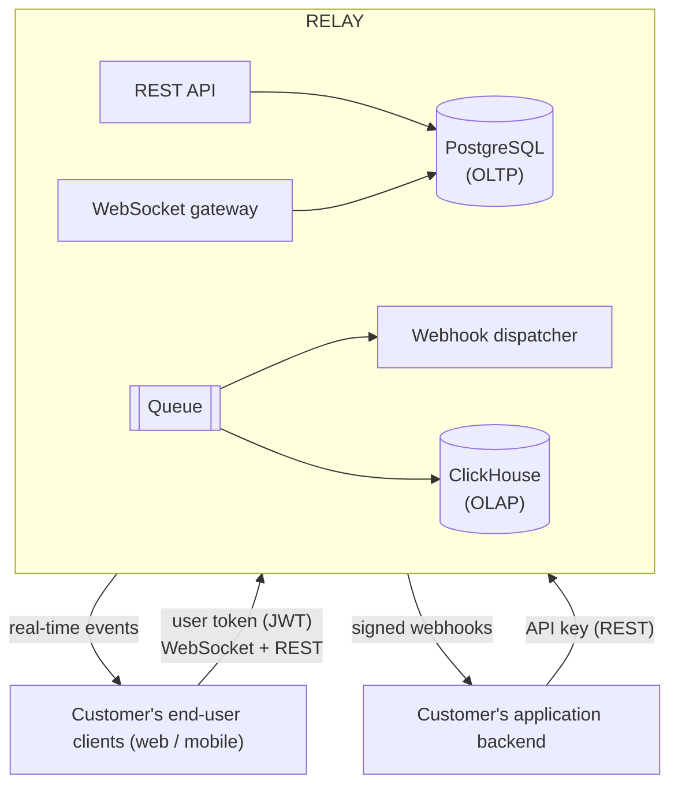
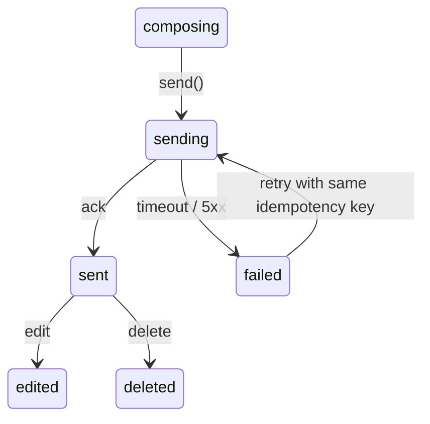
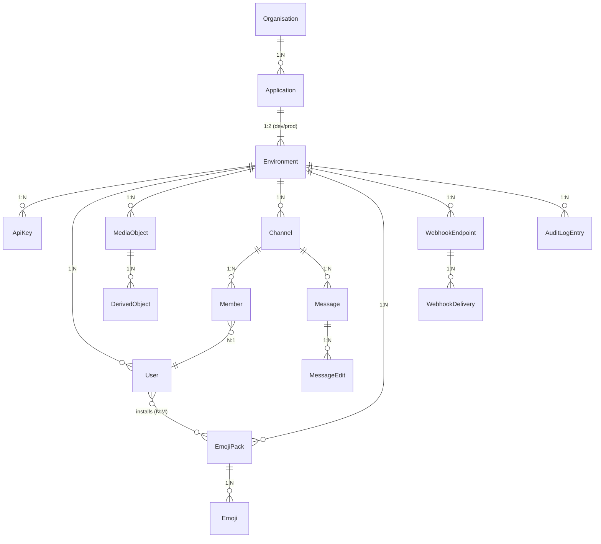

# Relay — Software Requirements Specification

**Version:** 1.3 (draft)
**Status:** For review
**Companion documents:** `01-product-vision.md`, `02-personas.md`, `03-journey-map.md`
**Structure:** adapted from ISO/IEC/IEEE 29148

---

## Table of contents

1. [Introduction](#1-introduction)
2. [Overall description](#2-overall-description)
3. [External interface requirements](#3-external-interface-requirements)
4. [Functional requirements](#4-functional-requirements)
5. [Non-functional requirements](#5-non-functional-requirements)
6. [Data requirements](#6-data-requirements)
7. [Traceability](#7-traceability)
8. [Appendices](#8-appendices)

---

## 1. Introduction

### 1.1 Purpose

This document specifies the functional and non-functional requirements for **Relay**, a
multi-tenant chat infrastructure platform delivered as an API. It is the reference for
implementation, test design, and acceptance.

It defines *what* the system must do. Component decomposition, technology selection beyond
stated constraints, and deployment topology belong to the architecture and design documents.

### 1.2 Scope

Relay provides real-time messaging as a service to software companies who embed it in their
own applications. It supplies message transport, persistence, membership, delivery
guarantees, webhooks, and usage analytics. It does not supply a user-facing chat application.

**In scope**

Multi-tenant organisation and application management · API key lifecycle · delegated
end-user authentication · channels and membership · message send, edit, delete, and history
· real-time delivery over WebSocket · presence and typing indicators · Unicode emoji and
customer-defined emoji packs that end users browse and install · hosted media attachments
(image, audio, video) with direct-to-storage upload, scanning, and signed delivery ·
webhook dispatch with
retry · per-tenant rate limiting and quotas · usage metering · a developer dashboard ·
a JavaScript client SDK.

**Out of scope for v1**

End-to-end encryption · voice and video *calls* · native iOS and Android SDKs · a hosted
end-user chat application · identity provision (customers own their user directory) ·
message search · threads and reactions · media transcoding beyond thumbnail/poster
generation · on-premise deployment.

### 1.3 Definitions

| Term | Meaning |
|---|---|
| **Organisation** | A Relay customer account. The billing and ownership boundary. |
| **Application** | A product belonging to an organisation. The tenancy boundary for data. |
| **Environment** | An isolated instance of an application: `development` or `production`. Separate keys, quotas, and data. |
| **Tenant** | An application–environment pair. All data is scoped to a tenant. |
| **API key** | A secret credential identifying an application environment, used for server-to-server calls. |
| **User token** | A short-lived JWT, signed by the customer's backend, authorising one end user. |
| **End user** | A person using the customer's product. Represented in Relay as a `User`. |
| **Channel** | A named conversation with a membership list. |
| **Member** | An end user's association with a channel, carrying a role and read state. |
| **Idempotency key** | A client-supplied identifier making a write operation safely repeatable. |
| **Tombstone** | The residual record of a deleted message, preserving order and audit trail. |
| **Emoji pack** | A named, environment-scoped collection of custom emoji defined by the customer, browsable and installable by end users. |
| **Shortcode** | The textual identifier of a custom emoji, written `:name:` inside message text, unique within an environment. |
| **Resolution map** | A sidecar object returned with messages, mapping each shortcode present in the returned text to its image URL and pack. |
| **Media object** | A file (image, audio, or video) uploaded to Relay-managed object storage, owned by a tenant, with a lifecycle of `pending → ready | rejected`. |
| **Upload slot** | A short-lived presigned URL authorising one direct client upload to object storage, issued against declared size and MIME type. |
| **Signed delivery URL** | A time-limited URL granting read access to a media object, issued only to callers whose channel membership permits reading the referencing message. |
| **Delivery event** | An analytical record of a message send, connection, API call, or webhook attempt. |

### 1.4 Requirement conventions

**Priority** — aligned to the phased roadmap in the vision document:

| Level | Meaning | Phase |
|---|---|---|
| **P1** | Core loop. Product does not exist without it. | Phase 1 |
| **P2** | Platform surface. Required for external customers. | Phase 2 |
| **P3** | Analytics and metering. Required for commercial operation. | Phase 3 |
| **P4** | Developer experience. Required for adoption at scale. | Phase 4 |
| **P5** | Deferred. Recorded, not scheduled. | Later |

**Verification method** — `T` test (automated) · `D` demonstration · `I` inspection ·
`A` analysis (including load testing).

Requirements use **shall** for obligations. Each has a unique, stable identifier;
identifiers are never reused after removal.

---

## 2. Overall description

### 2.1 Product perspective

Relay is a new, self-contained system with no predecessor. It sits between a customer's
application backend and their end-user clients.



The customer's backend is the trust anchor: it authenticates its own users and mints user
tokens. Relay verifies those tokens but never holds end-user credentials.

### 2.2 User classes

| Class | Description | Access mechanism | Frequency |
|---|---|---|---|
| **Integrating developer** (Mai) | Builds and maintains the integration | Dashboard + API key | Daily during integration, weekly after |
| **Engineering lead** (David) | Approves spend, monitors cost and reliability | Dashboard, read-only + billing | Monthly |
| **Customer backend** | Server-to-server automation | API key | Continuous |
| **End user** (Tuan) | Sends and receives messages | User token | Continuous |
| **Relay operator** | Internal support and platform operations | Internal admin, audited | As required |

### 2.3 Operating environment

**Server:** Linux, containerised, horizontally scalable. PostgreSQL 15+ for operational
data; ClickHouse 24+ for analytical data; Redis or NATS for pub/sub fan-out and presence;
a durable queue (Kafka, Redpanda, or NATS JetStream) between the operational and analytical
paths.

**Client:** the SDK shall support evergreen Chrome, Firefox, Safari, and Edge; Node.js 18+;
and React Native 0.72+.

### 2.4 Constraints

| ID | Constraint |
|---|---|
| CON-01 | Operational and analytical storage shall be physically separate. Analytical queries shall never execute against the operational database. |
| CON-02 | The system shall be horizontally scalable with no single-instance state; WebSocket connections shall not require sticky routing for correctness. |
| CON-03 | All external interfaces shall be authenticated. No unauthenticated endpoint shall return tenant data. |
| CON-04 | All timestamps shall be stored and transmitted in UTC, RFC 3339 format, with millisecond precision. |
| CON-05 | The public REST API shall be versioned in the URL path (`/v1/...`). Breaking changes require a new version. |
| CON-06 | The system shall not store end-user passwords or credentials of any kind. |

### 2.5 Assumptions and dependencies

| ID | Assumption | Consequence if false |
|---|---|---|
| ASM-01 | Customers can run server-side code to mint user tokens | Client-only applications cannot integrate securely; a hosted token endpoint would be required |
| ASM-02 | Customers maintain their own user identity system | Relay would need to become an identity provider — a stated non-goal |
| ASM-03 | End-user clients tolerate eventual delivery over WebSocket with reconnection backfill | Guaranteed synchronous delivery would require a different transport |
| ASM-04 | Message volume per tenant remains below 10 million per day in v1 | Sharding strategy would require redesign |
| ASM-05 | Customers accept server-side plaintext message storage | Non-negotiable for moderation and history; excludes E2E-required segments |
| ASM-06 | An S3-compatible object store with presigned URL support is available in every deployment target | Media (§4.14) would require a proxied upload path through Relay compute, invalidating NFR-PRF-08's design premise |

---

## 3. External interface requirements

### 3.1 REST API

| ID | Requirement | Pri | Ver |
|---|---|---|---|
| EIR-API-01 | The system shall expose a JSON over HTTPS REST API at `/v1`. | P1 | I |
| EIR-API-02 | All requests and responses shall use `application/json` with UTF-8 encoding. | P1 | T |
| EIR-API-03 | The API shall use conventional HTTP status codes: 200, 201, 204, 400, 401, 403, 404, 409, 422, 429, 500, 503. | P1 | T |
| EIR-API-04 | Error responses shall carry a machine-readable `code`, a human-readable `message`, an optional `field` naming the offending parameter, a `docs_url`, and the `request_id`. The five fields shall be **top-level in the response body**, not nested under an envelope key. | P1 | T |
| EIR-API-05 | Every response shall include a unique `X-Request-Id` header, referenced in all error responses and in the request log. | P2 | T |
| EIR-API-06 | List endpoints shall use opaque cursor pagination with `limit` and `cursor` parameters, returning `next_cursor` and `has_more`. Offset pagination shall not be offered. | P1 | T |
| EIR-API-07 | An OpenAPI 3.1 specification shall be published, machine-readable and complete for every public endpoint. | P4 | I |

**Error response format**

```json
{
  "code": "channel_member_limit_exceeded",
  "message": "Channel has reached its maximum of 1000 members.",
  "field": "user_ids",
  "docs_url": "https://docs.relay.dev/errors/channel_member_limit_exceeded",
  "request_id": "req_01HQ8X..."
}
```

> **Amended in 1.3.** This example nested the five fields under an `error` key until
> 2026-08-20. The implementation has emitted them top-level since the walking skeleton,
> and the document is being brought to the code rather than the reverse — recorded
> because the constitution's Governance section requires a conflict with this document to
> be resolved by explicit amendment rather than ignored.
>
> The flat shape is also the one that keeps EIR-API-04's stated purpose intact. The same
> five fields travel on the WebSocket surface inside a frame's `payload` (EIR-WS-02), so
> a REST body nested under `error` would make the two surfaces differ in **two** ways
> instead of one: the transport wrapper, which is unavoidable, and the field container,
> which is not.

### 3.2 WebSocket interface

| ID | Requirement | Pri | Ver |
|---|---|---|---|
| EIR-WS-01 | The system shall expose a WebSocket endpoint accepting a user token as a connection parameter. | P1 | T |
| EIR-WS-02 | All frames shall be JSON objects carrying a `type` discriminator and a `payload`. | P1 | T |
| EIR-WS-03 | The server shall send a `connection.ack` frame containing the resolved user identity and a resume cursor within 1 second of a successful handshake. | P1 | T |
| EIR-WS-04 | The server shall send a ping every 30 seconds and close connections that fail to respond to two consecutive pings. | P1 | T |
| EIR-WS-05 | The server shall reject connections with an expired or invalid token using close code `4001` and a diagnostic reason. | P1 | T |
| EIR-WS-06 | Close codes shall be documented and distinguish authentication failure, quota exhaustion, server shutdown, and protocol violation. | P2 | I |
| EIR-WS-07 | The protocol shall be fully documented, including reconnection, ordering, and backfill semantics. | P2 | I |

### 3.3 Webhook interface

| ID | Requirement | Pri | Ver |
|---|---|---|---|
| EIR-WHK-01 | The system shall deliver events to customer-configured HTTPS endpoints via HTTP POST with a JSON body. | P2 | T |
| EIR-WHK-02 | Each request shall carry an `X-Relay-Signature` header containing an HMAC-SHA256 of the timestamp and raw body, keyed on the endpoint's signing secret. | P2 | T |
| EIR-WHK-03 | Each request shall carry an `X-Relay-Timestamp` header to permit replay-window validation by the recipient. | P2 | T |
| EIR-WHK-04 | Each event shall carry a stable `id`, enabling recipient-side deduplication. | P2 | T |
| EIR-WHK-05 | A 2xx response shall be treated as success; any other response or a timeout exceeding 10 seconds shall be treated as failure. | P2 | T |

### 3.4 Dashboard interface

| ID | Requirement | Pri | Ver |
|---|---|---|---|
| EIR-DSH-01 | The dashboard shall be a responsive web application usable at viewport widths from 1280 px down to 768 px. | P2 | D |
| EIR-DSH-02 | The dashboard shall consume only the same public API available to customers, except for internal billing endpoints. | P2 | I |
| EIR-DSH-03 | The dashboard shall meet WCAG 2.1 Level AA for keyboard navigation, focus visibility, and colour contrast. | P4 | I |

---

## 4. Functional requirements

### 4.1 Tenancy and application management — `FR-TEN`

| ID | Requirement | Pri | Ver |
|---|---|---|---|
| FR-TEN-01 | A user shall be able to create an organisation by authenticating with GitHub or Google OAuth, providing no information beyond that granted by the provider. | P2 | T |
| FR-TEN-02 | On organisation creation the system shall automatically create one application and one `development` environment, without further user input. | P2 | D |
| FR-TEN-03 | An organisation shall support multiple applications, each with independent data, keys, and quotas. | P2 | T |
| FR-TEN-04 | Each application shall have exactly two environments, `development` and `production`, with separate credentials, quotas, and datastores. | P2 | T |
| FR-TEN-05 | No API operation shall return, modify, or reveal the existence of data belonging to another tenant, under any input. | P1 | T, A |
| FR-TEN-06 | Every persisted operational and analytical record shall carry a non-null tenant identifier. | P1 | I, T |
| FR-TEN-07 | An organisation shall support multiple human members with roles `owner`, `admin`, and `member`. Only `owner` may delete the organisation or change billing. | P2 | T |
| FR-TEN-08 | Deleting an application shall irreversibly delete all associated operational data within 30 days and shall be confirmed by typing the application name. | P2 | T |

> **FR-TEN-05 is the single most important requirement in this document.** A violation is
> classified Sev-0. Verification includes an automated cross-tenant access test suite
> executed against every endpoint on every build.

### 4.2 Authentication and authorisation — `FR-AUT`

| ID | Requirement | Pri | Ver |
|---|---|---|---|
| FR-AUT-01 | The system shall issue API keys scoped to a single application environment, presented as a bearer token. | P2 | T |
| FR-AUT-02 | API key secrets shall be displayed exactly once, at creation, and stored only as a salted hash thereafter. | P2 | I, T |
| FR-AUT-03 | API keys shall carry a visible, non-secret prefix identifying the environment (`rk_dev_`, `rk_live_`). | P2 | T |
| FR-AUT-04 | The system shall support multiple concurrent active keys per environment to permit rotation without downtime. | P2 | T |
| FR-AUT-05 | Revoking a key shall take effect within 5 seconds across all instances. | P2 | T |
| FR-AUT-06 | The system shall accept end-user authentication via JWT signed with the application's secret using HS256, containing `sub` (user ID), `exp`, and `iat`. | P1 | T |
| FR-AUT-07 | User tokens with an `exp` more than 24 hours beyond `iat` shall be rejected. | P2 | T |
| FR-AUT-08 | User tokens shall be rejected if expired, malformed, incorrectly signed, or issued for a different application. | P1 | T |
| FR-AUT-09 | In the `development` environment only, the system shall provide an endpoint that mints a user token from an API key, so that a developer may reach a first message before implementing token signing. | P2 | T |
| FR-AUT-10 | User tokens shall not authorise administrative operations. Creating channels with arbitrary membership, deleting others' messages, and all tenant management shall require an API key. | P1 | T |
| FR-AUT-11 | Expiry of a user token shall not terminate an established WebSocket connection; the client shall be permitted to supply a refreshed token over the existing connection. | P2 | T |
| FR-AUT-12 | Failed authentication attempts shall be rate limited per source IP address. | P2 | T |

> **Design note (journey Stage 4).** Confusion between API keys and user tokens is the most
> common first-integration failure. FR-AUT-03 and FR-AUT-09 exist specifically to reduce it,
> and the error message for using the wrong credential type must name the mistake explicitly.

### 4.3 User management — `FR-USR`

| ID | Requirement | Pri | Ver |
|---|---|---|---|
| FR-USR-01 | The system shall represent end users by an identifier supplied by the customer, unique within a tenant. Relay shall not generate end-user identities. | P1 | T |
| FR-USR-02 | A user record shall be created implicitly on first authentication if it does not exist. | P1 | T |
| FR-USR-03 | Customers shall be able to set and update display name, avatar URL, and an arbitrary JSON metadata object of up to 4 KB per user. | P1 | T |
| FR-USR-04 | The system shall support upserting up to 100 users in a single request. | P2 | T |
| FR-USR-05 | Deleting a user shall remove profile data and memberships while preserving their messages as authored by a deleted user, unless message deletion is explicitly requested. | P2 | T |
| FR-USR-06 | The system shall support banning a user at tenant scope, preventing connection and message send while preserving history. | P3 | T |
| FR-USR-07 | Customers shall be able to create bot users representing their own software, each carrying a description of what it is and why it posts. A bot user shall not authenticate. | P2 | T |

> **AMENDMENT, chapter 3.17 — FR-USR-07 and FR-MSG-15 added, FR-MSG-13 and FR-RTL-05
> narrowed.** Until this chapter a message sent with an application key named nobody, and the
> SRS had no word for the thing a customer's software is. Three chapters since have made the
> sender decide what is rendered, what is delivered and what may be seen, so a message with no
> sender became a row those three chapters cannot describe.
>
> **FR-USR-07** is new: a bot user, carrying a description, that cannot authenticate. It is not
> a new kind of row — it is a `users` row with a stored property — because every reader built
> since chapter 3.15 already reads that table.
>
> **FR-MSG-13 was already here, and it is being MET rather than introduced.** It has said since
> v1 that a key may send *on behalf of a user*, and chapter 3.3 satisfied it by sending
> unattributed — a decision that was right when nothing read the sender, and that
> `messages.controller.ts` has recorded ever since as *"A tenant's own server sending on a
> customer's behalf is FR-MSG-13, not a mistake."* This chapter is the first implementation that
> names the user. The clause is narrowed from *any user* to *a bot user of that tenant*, in
> place: adding a clause beside it would have left this document asserting both that a key may
> send as anyone and that it may send only as a bot.
>
> **FR-MSG-15** carries only what FR-MSG-13 does not — that every message has a sender at all.
>
> **FR-RTL-05 is narrowed from "unique active users" to "unique active persons", and FR-ANL-05
> is deliberately unchanged.** A bot is metered like any user and is exempt from the enforced
> ceiling: the ceiling bounds a customer's human population, and a customer's own software
> should not be able to lock their people out of sending. Metering and enforcement were already
> two clauses in two families before this chapter needed them to be.
>
> **FR-RTL-08's exception, stated rather than discovered.** *"Quota exhaustion shall degrade
> predictably: sends rejected with a specific error code."* A bot's send is not rejected at
> exhaustion. Uncited that is a defect report; here it is a decision.
>
> **FR-MSG-01 is unchanged** — it describes what a message contains and does not mention a
> sender. A later reader must not look for the sender rule there. **FR-MSG-08 is unchanged**
> too, and worth naming: its tombstone already retains the *author*, which agrees with FR-MSG-15
> and has never been built.
>
> **How the two new clauses are verified (T073).** `FR-USR-07` by test: the bot round
> trip, the description rules at the boundary and at the database, and the promotion in all
> three of its states. `FR-MSG-15` by **compilation** as well as by test —
> `repository.sendMessage` takes `userId: string`, so a senderless write does not build,
> and the evidence is a `typecheck` transcript rather than a failing test. A compile-time
> guarantee has no red test to watch, which is why the amendment says so here rather than
> leaving a reader to look for one.
>
> **FR-USR-01 still holds for bots.** *"Relay shall not generate end-user identifiers"* — a
> bot's identifier is customer-supplied like any other, and the platform invents nothing. The
> alternative this chapter rejected was a synthetic sender the platform mints for a key, which
> is what chapter 3.10 argued against and still argues against; a bot is a *declared* identity
> the customer creates, names and describes.

> **Verification, FR-USR-02 to FR-USR-06 (chapters 3.15 and 3.16).** Five of these six
> clauses were unimplemented until then, and two things are worth recording beyond "tested".
>
> **FR-USR-02** had a symptom rather than a gap: minting a token for an unknown identifier
> and sending through the internal route answered `400 "unknown user"`, which names the
> caller when the cause is that nobody created a row. Implicit creation now happens on the
> mint path, and the response deliberately does **not** distinguish "created" from
> "existed" — a status that did would let a caller enumerate a tenant's external ids.
>
> **FR-USR-03**'s two bounds are 4 KB for a user against FR-CHN-01's 8 KB for a channel.
> The difference is row cardinality and is now stated where the constant is: users
> outnumber channels 3.4:1 on the test lane and the ratio only grows, because a channel is
> created deliberately and a user row appears for every end user who authenticates.
>
> **FR-USR-05** keeps the row. `ON DELETE SET NULL` on `messages.user_id` satisfies the
> letter of "preserving their messages" and breaks delivery: the resume path drops a
> senderless row, so every message a deleted user ever sent would vanish from every
> reconnecting client with a sequence gap as the only trace. Verified on the socket, not
> only in storage.
>
> **FR-USR-06** is enforced at connect and on the send path, and the ban check runs
> *before* the channel is resolved — so a banned user gets one answer for every channel id
> and cannot enumerate them. An already-open socket stops writing and keeps receiving,
> which is the shape FR-AUT-11 already required for an expired token.

### 4.4 Channels and membership — `FR-CHN`

| ID | Requirement | Pri | Ver |
|---|---|---|---|
| FR-CHN-01 | The system shall support creating a channel with a customer-supplied identifier unique within a tenant, a type, a display name, and up to 8 KB of JSON metadata. | P1 | T |
| FR-CHN-02 | Channel creation shall be idempotent on the customer-supplied identifier: repeating the request shall return the existing channel rather than an error. | P1 | T |
| FR-CHN-03 | The system shall support channel types `public` (any authenticated user of the tenant may read and join) and `private` (members only). | P1 | T |
| FR-CHN-04 | Members shall hold one of the roles `owner`, `moderator`, or `member`. | P2 | T |
| FR-CHN-05 | A user shall not read messages from, send messages to, or observe presence in a private channel of which they are not a member. | P1 | T |
| FR-CHN-06 | The system shall support adding and removing up to 100 members in a single request. | P1 | T |
| FR-CHN-07 | A channel shall support up to 1,000 members. Exceeding the limit shall return `422` with a specific error code. | P1 | T |
| FR-CHN-08 | The system shall support listing a user's channels, ordered by most recent activity, with cursor pagination. | P1 | T |
| FR-CHN-09 | Channel listings shall include the caller's unread count and the most recent message. | P2 | T |
| FR-CHN-10 | Archiving a channel shall preserve history and prevent new messages. Archiving shall be reversible. | P2 | T |

> **Verification, FR-CHN-03 to FR-CHN-10 (chapters 3.15 and 3.16).** `channels.type` had
> carried `public | private` with a CHECK constraint since the first migration while **no
> decision consulted it** — it was declared, selected and returned by the create route, so
> "nothing reads it" was false and "nothing decides on it" was the true and sharper
> statement. FR-CHN-03 and FR-CHN-05 are what made it decide.
>
> **FR-CHN-05 has four doors** — the send path, the read-by-id path, the history path and
> the socket session — and the enum accepting `private` was widened **last**, after all
> four held. Each refusal is byte-identical to a channel that does not exist, verified by
> the same indistinguishability oracle NFR-SEC-09's suite uses for cross-tenant attacks,
> extended with a same-tenant fixture. A `403` naming the membership would announce that
> the channel exists.
>
> **FR-CHN-04's roles are not `FR-TEN-07`'s.** `owner`, `moderator`, `member` against an
> organisation's `owner`, `admin`, `member` — one word apart, and a migration reusing the
> organisation's constraint would accept `admin` on a channel member and look correct in
> review. Both CHECK constraints now name the other. The listing returns a member's role
> and **no operation is authorized by it**, which is the statement worth making rather
> than "nothing reads it".
>
> **FR-CHN-09's count has no counter**: `greatest(last_sequence − read_position, 0)`,
> because `last_sequence` is already the sequencing authority. Measured against 1,000,000
> messages, counting rows past the position is 9.8–13.4 ms, a cached counter is 1.2–2.1 ms
> and the subtraction is 1.1–4.5 ms — the counter is no faster and adds a value that can
> go stale. The approximation this accepts is stated: **a deleted message still counts as
> one unread**, because a tombstone keeps its sequence.
>
> **FR-CHN-08's ordering key is indexed and the index is earned.** Ordering by the last
> message's timestamp costs 0.87 ms on the test lane and 159 ms at 1,000,000 messages with
> a sequential scan over every message in the environment; an indexed
> `channels.last_activity_at` is 1.1 ms. The listing's own plan was measured at four
> scales, and the first page is the most expensive one — the reverse of an offset
> paginator, because a keyset narrows the input set as it pages.
>
> **FR-CHN-10's refusal order is part of the requirement.** Ban, then membership and
> visibility, then archive. Reverse the last two and a non-member of a private *archived*
> channel learns it exists from `channel_archived`.

### 4.5 Messaging — `FR-MSG`

| ID | Requirement | Pri | Ver |
|---|---|---|---|
| FR-MSG-01 | The system shall accept a message containing text of up to 8,000 characters and up to 4 KB of JSON metadata. | P1 | T |
| FR-MSG-02 | The system shall assign every message a monotonically increasing, gap-tolerant sequence number, unique and strictly ordered within a channel. | P1 | T |
| FR-MSG-03 | Message ordering within a channel shall be determined solely by server-assigned sequence number, never by client timestamp. | P1 | T, A |
| FR-MSG-04 | The system shall accept a client-supplied idempotency key on send. A repeated key within 24 hours shall return the original message with `201`-equivalent semantics and shall not create a duplicate. | P1 | T |
| FR-MSG-05 | The system shall acknowledge a send only after the message is durably persisted. | P1 | T |
| FR-MSG-06 | An acknowledged message shall not be lost. | P1 | A |
| FR-MSG-07 | The system shall support editing message text, preserving the original sequence number and recording an immutable edit history with timestamps. | P2 | T |
| FR-MSG-08 | Deleting a message shall replace its content with a tombstone retaining sequence number, author, timestamps, and deletion metadata. Hard deletion shall occur only via the compliance deletion endpoint. | P2 | T |
| FR-MSG-09 | The system shall support retrieving channel history in both directions from a cursor, with a maximum page size of 200. | P1 | T |
| FR-MSG-10 | History responses shall include tombstones so that clients can render deletions without gaps in ordering. | P2 | T |
| FR-MSG-11 | The system shall support up to 10 attachments per message. An attachment is either a reference to a Relay-hosted media object (`media_id`, see §4.14) or an external URL with a declared kind (`image`, `audio`, `video`). | P2 | T |
| FR-MSG-12 | The system shall record and expose per-user read state as the highest sequence number read in a channel. | P2 | T |
| FR-MSG-13 | The system shall support sending a message on behalf of a bot user of that tenant via API key, for backend-originated messages. | P2 | T |
| FR-MSG-14 | Threads, reactions, and full-text search shall not be implemented in v1. Emoji *reactions* remain excluded; emoji within message content is specified in §4.13. | P5 | I |
| FR-MSG-15 | Every message shall carry a sender. A message accepted with no sender shall not be created. | P1 | T |

**Message state machine (client-observable)**



The SDK shall surface `sending`, `sent`, and `failed` distinctly (see FR-SDK-05) so that
customer interfaces can represent delivery honestly rather than optimistically.

### 4.6 Real-time delivery — `FR-RTM`

| ID | Requirement | Pri | Ver |
|---|---|---|---|
| FR-RTM-01 | A connected client shall receive messages for every channel of which it is a member, without per-channel subscription. | P1 | T |
| FR-RTM-02 | Delivery shall function correctly when sender and recipient are connected to different gateway instances. | P1 | T, A |
| FR-RTM-03 | On reconnection with a resume cursor, the system shall deliver all messages with a sequence number greater than the cursor for every channel of which the user is a member. | P1 | T |
| FR-RTM-04 | Backfill exceeding 500 messages in a channel shall return a truncation indicator instructing the client to refetch history rather than streaming the entire backlog. | P2 | T |
| FR-RTM-05 | The system shall emit real-time events for message creation, edit, deletion, membership change, presence change, and typing. | P1 | T |
| FR-RTM-06 | The system shall track presence with states `online` and `offline`, derived from connection state with a 30-second grace period. | P1 | T |
| FR-RTM-07 | Presence updates shall be delivered only to users sharing at least one channel with the subject. | P1 | T |
| FR-RTM-08 | Typing indicators shall expire automatically after 5 seconds without renewal and shall not be persisted. | P2 | T |
| FR-RTM-09 | A user shall be permitted up to 5 concurrent connections; each shall receive all events independently. | P2 | T |
| FR-RTM-10 | Events shall not be delivered to a client whose membership no longer grants access, effective within 5 seconds of the membership change. | P1 | T |

### 4.7 Webhooks — `FR-WHK`

| ID | Requirement | Pri | Ver |
|---|---|---|---|
| FR-WHK-01 | Customers shall be able to configure up to 5 webhook endpoints per environment, each subscribing to a selected set of event types. | P2 | T |
| FR-WHK-02 | The system shall emit at minimum: `message.created`, `message.updated`, `message.deleted`, `channel.created`, `channel.member_added`, `channel.member_removed`, `user.connected`, `user.disconnected`. | P2 | T |
| FR-WHK-03 | Failed deliveries shall be retried with exponential backoff at approximately 1 s, 5 s, 30 s, 5 min, 30 min, 2 h — six attempts in total. | P2 | T |
| FR-WHK-04 | After exhausting retries an event shall be moved to a dead-letter store, retained for 7 days, and made inspectable and manually replayable from the dashboard. | P2 | T |
| FR-WHK-05 | Webhook delivery shall be asynchronous and shall never delay or block message delivery to end users. | P2 | T, A |
| FR-WHK-06 | Every delivery attempt shall be recorded with timestamp, response status, latency, and error, and shall be queryable for 30 days. | P3 | T |
| FR-WHK-07 | An endpoint returning failures for more than 1 hour continuously shall be automatically disabled, and the organisation notified by email. | P3 | T |
| FR-WHK-08 | Each endpoint shall have an independently rotatable signing secret. | P2 | T |
| FR-WHK-09 | The dashboard shall permit sending a synthetic test event to any configured endpoint. | P4 | D |

### 4.8 Rate limiting and quotas — `FR-RTL`

| ID | Requirement | Pri | Ver |
|---|---|---|---|
| FR-RTL-01 | The system shall enforce per-tenant rate limits on REST requests, message sends, and connection establishment. | P2 | T |
| FR-RTL-02 | Every rate-limited response shall include `X-RateLimit-Limit`, `X-RateLimit-Remaining`, and `X-RateLimit-Reset` headers. Headers shall be present on successful responses, not only on `429`. | P2 | T |
| FR-RTL-03 | Rate-limited requests shall return `429` with a `Retry-After` header. | P2 | T |
| FR-RTL-04 | Development and production environments shall have entirely independent limits and counters. | P2 | T |
| FR-RTL-05 | The system shall enforce configurable monthly quotas on messages sent, unique active persons, and connection-minutes. | P3 | T |
| FR-RTL-06 | Organisations shall be able to configure a hard spending cap that suspends the environment on breach, and a soft threshold that only alerts. | P3 | T |
| FR-RTL-07 | The system shall email organisation admins at 50%, 80%, and 100% of configured quota. | P3 | T |
| FR-RTL-08 | Quota exhaustion shall degrade predictably: sends rejected with a specific error code; existing connections and history reads unaffected. | P3 | T |

> **Design note.** FR-RTL-06 is a purchasing requirement, not a technical one. Unbounded
> cost exposure is David's principal objection (journey, diligence phase).

### 4.9 Analytics and metering — `FR-ANL`

| ID | Requirement | Pri | Ver |
|---|---|---|---|
| FR-ANL-01 | The system shall emit an analytical event for every message send, connection open and close, API request, and webhook delivery attempt. | P3 | T |
| FR-ANL-02 | Analytical events shall be written to the analytical store via a durable queue, never synchronously on the request path. | P3 | I, A |
| FR-ANL-03 | Failure or backlog of the analytical pipeline shall not affect message delivery, API availability, or webhook dispatch. | P3 | A |
| FR-ANL-04 | Analytical events shall be available for query within 60 seconds of the originating operation under normal conditions. | P3 | A |
| FR-ANL-05 | The system shall meter, per tenant per day: messages sent, unique active users, connection-minutes, and stored message count. | P3 | T |
| FR-ANL-06 | Metered totals shall agree with counts derived from operational data to within 0.1%, verified by a daily reconciliation job that raises an alert on breach. | P3 | T |
| FR-ANL-07 | The system shall retain a queryable API request log per tenant for 30 days, recording request ID, timestamp, endpoint, method, status, latency, and truncated payload. | P3 | T |
| FR-ANL-08 | Analytical queries over 90 days of a single tenant's data shall return within 2 seconds at p95. | P3 | A |
| FR-ANL-09 | Usage shall be attributable by application, environment, channel, and day. | P3 | T |
| FR-ANL-10 | The system shall compute end-to-end delivery latency percentiles (p50, p95, p99) per tenant per hour. | P3 | T |
| FR-ANL-11 | Analytical records containing message content shall store only length and metadata, never message text. | P3 | I |
| FR-ANL-12 | The system shall alert an organisation when daily usage exceeds twice the trailing 7-day average. | P4 | T |

> **FR-ANL-11 matters.** The analytical store is optimised for aggregate queries, retained
> longer, and accessed by more internal systems. Message content stays in the operational
> store, where deletion semantics are enforceable.

### 4.10 Moderation and compliance — `FR-MOD`

| ID | Requirement | Pri | Ver |
|---|---|---|---|
| FR-MOD-01 | The system shall permit retrieving any channel's complete history, including tombstones and edit history, via API key. | P2 | T |
| FR-MOD-02 | The system shall permit deleting any message via API key, irrespective of author. | P2 | T |
| FR-MOD-03 | Every moderation action shall be recorded in an immutable audit log with actor, action, target, timestamp, and request ID, retained for 1 year. | P3 | T |
| FR-MOD-04 | The system shall provide an endpoint that permanently erases all data for a specified end user — messages, memberships, profile, and analytical records — completing within 30 days and returning a completion receipt. | P3 | T |
| FR-MOD-05 | The system shall support exporting all data for a tenant as newline-delimited JSON, generated asynchronously with a notification on completion. | P3 | T |
| FR-MOD-06 | Configurable message retention per environment (30 / 90 / 365 days / indefinite) shall be supported, with expired messages hard-deleted by a scheduled job. | P3 | T |
| FR-MOD-07 | The system shall support an optional pluggable content classifier evaluated before persistence, capable of rejecting or flagging a message. | P5 | T |

### 4.11 Developer dashboard — `FR-DSH`

| ID | Requirement | Pri | Ver |
|---|---|---|---|
| FR-DSH-01 | The dashboard shall display a development API key on the first screen following signup, copyable in a single action. | P2 | D |
| FR-DSH-02 | The dashboard shall provide a live event stream showing connections, messages, and API calls as they occur, with a latency under 2 seconds. | P2 | D |
| FR-DSH-03 | The dashboard shall provide a searchable request log filterable by endpoint, status, and time range, with full request and response detail. | P3 | D |
| FR-DSH-04 | The dashboard shall display usage against quota for the current billing period, with a projected month-end figure. | P3 | D |
| FR-DSH-05 | The dashboard shall chart message volume, active users, error rate, and delivery latency percentiles over selectable ranges up to 90 days. | P3 | D |
| FR-DSH-06 | The dashboard shall list webhook deliveries with status, and permit inspection and replay of failures. | P3 | D |
| FR-DSH-07 | The dashboard shall provide a channel browser for inspecting channels and messages during development. | P4 | D |
| FR-DSH-08 | The dashboard shall provide a cost estimator accepting projected user count and messages per user per day. | P4 | D |

> **FR-DSH-02 is the highest-leverage single feature in the product** (journey, Stage 4).
> Seeing the first message arrive in the dashboard converts uncertainty into confidence
> faster than documentation can.

### 4.12 Client SDK — `FR-SDK`

| ID | Requirement | Pri | Ver |
|---|---|---|---|
| FR-SDK-01 | A JavaScript SDK shall be published to npm, functioning in browsers, Node.js 18+, and React Native. | P4 | T |
| FR-SDK-02 | The SDK shall ship complete TypeScript type definitions. | P4 | I |
| FR-SDK-03 | The SDK shall provide transport, state, and events only. It shall contain no UI components and no styling. | P4 | I |
| FR-SDK-04 | The SDK shall reconnect automatically with exponential backoff and jitter, capped at 30 seconds, resuming from its last cursor. | P4 | T |
| FR-SDK-05 | The SDK shall expose `sending`, `sent`, and `failed` states for every outbound message, and shall support optimistic local insertion. | P4 | T |
| FR-SDK-06 | The SDK shall generate idempotency keys automatically and reuse them across retries of the same logical send. | P4 | T |
| FR-SDK-07 | The SDK shall queue outbound messages while disconnected and flush them in order on reconnection. | P4 | T |
| FR-SDK-08 | The SDK shall be under 30 KB minified and gzipped, excluding peer dependencies. | P4 | T |
| FR-SDK-09 | The SDK shall accept a token provider callback rather than a static token, so that expiry is handled without reconnection. | P4 | T |
| FR-SDK-10 | A reference chat client shall be published, built exclusively against the public API and SDK, with source available. | P4 | D |

### 4.13 Emoji and emoji packs — `FR-EMJ`

Two distinct capabilities: **Unicode emoji** (standard emoji inside message text — a
correctness obligation, Phase 1) and **custom emoji packs** (customer-defined emoji that
end users browse and install — a feature, Phase 3+).

**Unicode emoji**

| ID | Requirement | Pri | Ver |
|---|---|---|---|
| FR-EMJ-01 | The system shall accept, store, and return Unicode emoji byte-exactly in message text, channel names, and user display names, including ZWJ sequences, skin-tone modifiers, and flag sequences. No normalisation shall alter emoji content. | P1 | T |
| FR-EMJ-02 | The message length limit (FR-MSG-01) shall be counted in Unicode code points, and this shall be documented. A single displayed emoji may therefore consume multiple code points; the SDK shall expose the same counting function so client-side validation agrees with the server. | P1 | T |

**Custom emoji packs**

| ID | Requirement | Pri | Ver |
|---|---|---|---|
| FR-EMJ-03 | Customers shall be able to create, update, and delete emoji packs at environment scope via API key. A pack shall have a customer-supplied external ID, a display name, an optional description and cover image URL, and up to 200 emoji. | P3 | T |
| FR-EMJ-04 | Each custom emoji shall have a shortcode matching `^[a-z0-9_]{2,64}$`, an image URL, and optional search tags. Shortcodes shall be unique within an environment across all packs, so that `:name:` resolves unambiguously. | P3 | T |
| FR-EMJ-05 | A pack shall be `listed` (appears in the browsable catalog for all users of the environment) or `unlisted` (installable only by direct pack ID). | P3 | T |
| FR-EMJ-06 | End users shall be able to browse listed packs with cursor pagination and search them by name and tag, via user token. | P3 | T |
| FR-EMJ-07 | End users shall be able to install and uninstall packs on their account, and retrieve their installed set. A user may install up to 50 packs. Installation state shall be per-user, per-environment. | P3 | T |
| FR-EMJ-08 | Custom emoji shall be written in message text as `:shortcode:`. Message and history responses shall include a resolution map covering every shortcode present in the returned messages, so clients render without additional round trips. | P3 | T |
| FR-EMJ-09 | Installation shall be a picker convenience, not a permission: a user may send any shortcode valid in the environment regardless of installed packs. Authorisation of *content* is the customer's moderation concern, not the emoji system's. | P3 | T |
| FR-EMJ-10 | Deleting a pack or emoji shall not mutate historical messages. Unresolvable shortcodes shall be marked as such in the resolution map, and clients shall fall back to rendering the literal text. | P3 | T |
| FR-EMJ-11 | The system shall record aggregate emoji usage (shortcode or code point, count, per tenant per day) as analytical events. Only the emoji identifier shall be recorded, never surrounding message text, preserving FR-ANL-11's content prohibition. | P4 | T |
| FR-EMJ-12 | The dashboard shall provide pack management (create, upload emoji list, reorder, delete) and a top-emoji usage view. | P4 | D |
| FR-EMJ-13 | The SDK shall provide shortcode parsing/segmentation of message text, a resolution-map cache, and a data source suitable for building an emoji picker (installed packs + search). Consistent with FR-SDK-03, the SDK shall ship no picker UI. | P4 | T |

> **Design notes.**
> (1) Relay hosts no emoji images in v1 — packs reference customer-hosted URLs, consistent
> with FR-MSG-11 and the file-storage exclusion. Image availability and CDN caching are the
> customer's responsibility and shall be documented.
> (2) FR-EMJ-09 is a deliberate stance: making installation a *permission* would put an
> authorisation check on the message hot path and create a support-facing failure mode
> ("my emoji stopped working") for no security benefit — shortcodes are environment-public
> by construction.
> (3) FR-EMJ-10 exists for Priya: a dispute record must render as it was written, even if
> the pack was deleted since (journey 3, stage 3).

### 4.14 Hosted media — `FR-MED`

Relay hosts media attachments: image, audio, and video. The design principle, defended in
SAD ADR-13: **bytes never transit Relay's compute** — clients upload directly to object
storage via presigned URLs and download via signed URLs; Relay's services handle only
metadata, authorisation, and the scan pipeline.

**Upload**

| ID | Requirement | Pri | Ver |
|---|---|---|---|
| FR-MED-01 | The system shall issue an upload slot on request (user token or API key), given a declared filename, MIME type, and byte size. The slot shall contain a presigned URL valid for 15 minutes and a `media_id` in state `pending`. | P3 | T |
| FR-MED-02 | Upload slots shall be refused when: the MIME type is outside the allowed set (image/jpeg, png, gif, webp; audio/mpeg, mp4, ogg, wav; video/mp4, webm); the declared size exceeds the per-kind cap (image 10 MB, audio 25 MB, video 100 MB); or the environment's storage quota would be exceeded. Each refusal shall use a distinct error code. | P3 | T |
| FR-MED-03 | The system shall verify actual object size and content type after upload; objects that contradict their declaration shall be `rejected` and deleted. | P3 | T |
| FR-MED-04 | Every uploaded object shall be virus-scanned and content-probed (dimensions for images; duration for audio/video) asynchronously before transitioning `pending → ready`. Objects failing the scan shall transition to `rejected` and be deleted, retaining only the audit record. | P3 | T |
| FR-MED-05 | The system shall generate a thumbnail for images and a poster frame for videos during processing, stored as derived objects sharing the parent's lifecycle. | P4 | T |

**Attachment and delivery**

| ID | Requirement | Pri | Ver |
|---|---|---|---|
| FR-MED-06 | A message may attach a `media_id` in state `pending` or `ready`, provided the media object belongs to the same environment and (for user tokens) was uploaded by the sending user. Attaching another tenant's or user's media shall fail. | P3 | T |
| FR-MED-07 | Real-time and history delivery shall include each attachment's state. A `media.updated` event shall be delivered on the referencing channels when a pending attachment becomes `ready` or `rejected`, so clients can replace placeholders without polling. | P3 | T |
| FR-MED-08 | Media objects shall be readable only via signed delivery URLs with a validity of 1 hour, issued only to callers authorised to read the referencing message (channel membership or API key). Object storage shall not be publicly readable. | P3 | T |
| FR-MED-09 | A `rejected` attachment shall render as an explicit rejection marker in history — never as a broken link — preserving the record that *something* was sent (Priya's reconstruction must distinguish "rejected upload" from "deleted message"). | P3 | T |

**Lifecycle, quota, and compliance**

| ID | Requirement | Pri | Ver |
|---|---|---|---|
| FR-MED-10 | Deleting a message (tombstone) shall unlink its attachments; unreferenced media objects shall be hard-deleted by a scheduled job after 24 hours. Compliance erasure (FR-MOD-04) shall delete a user's media objects and derived objects within the same 30-day bound. | P3 | T |
| FR-MED-11 | Environment retention policy (FR-MOD-06) shall apply to media: expired messages delete their objects with them. | P3 | T |
| FR-MED-12 | The system shall meter stored media bytes per tenant per day and count uploads by kind, included in quota enforcement (FR-RTL-05) and visible in the dashboard alongside other usage (FR-DSH-04/05). | P3 | T |
| FR-MED-13 | Media upload/processing events (`media.uploaded`, `media.ready`, `media.rejected`) shall be available as webhook event types (extending FR-WHK-02). | P4 | T |
| FR-MED-14 | The SDK shall provide upload helpers (slot request, direct PUT, progress, retry) and attachment-state handling; the reference client shall demonstrate image and audio send/receive. | P4 | T |

> **Design notes.**
> (1) FR-MED-06 permits attaching `pending` media so a photo can be *sent* the moment
> upload completes, with recipients seeing a placeholder until the scan clears — matching
> user expectations set by consumer messengers. The scan is a delivery gate for *bytes*,
> never for the *message*.
> (2) FR-MED-08 makes authorisation follow the message, not the file: media access control
> inherits channel membership rather than inventing a parallel ACL system.
> (3) This section reverses Appendix B's original exclusion; the reversal rationale is
> recorded there.

---

## 5. Non-functional requirements

### 5.1 Performance — `NFR-PRF`

| ID | Requirement | Target | Ver |
|---|---|---|---|
| NFR-PRF-01 | End-to-end delivery latency: send acknowledged to recipient receipt, same region | p50 < 100 ms · p95 < 250 ms · p99 < 500 ms | A |
| NFR-PRF-02 | REST write latency, excluding network | p95 < 150 ms | A |
| NFR-PRF-03 | History read latency, 50 messages | p95 < 100 ms | A |
| NFR-PRF-04 | WebSocket handshake to `connection.ack` | p95 < 1 s | A |
| NFR-PRF-05 | Reconnection with backfill of 100 messages | p95 < 2 s | A |
| NFR-PRF-06 | Analytical query over 90 days, single tenant | p95 < 2 s | A |
| NFR-PRF-07 | Dashboard initial paint | p95 < 2 s | A |
| NFR-PRF-08 | Upload-slot issuance and signed-URL generation (metadata only — bytes go direct to storage) | p95 < 100 ms | A |
| NFR-PRF-09 | Scan-pipeline latency, upload complete → `ready`, images ≤ 10 MB | p95 < 10 s | A |

### 5.2 Scalability — `NFR-SCL`

| ID | Requirement | Pri | Ver |
|---|---|---|---|
| NFR-SCL-01 | The system shall sustain 10,000 concurrent WebSocket connections per gateway instance. | P1 | A |
| NFR-SCL-02 | Gateway instances shall be addable and removable without connection loss on surviving instances and without configuration change. | P1 | A |
| NFR-SCL-03 | The system shall sustain 1,000 messages per second aggregate at the stated latency targets. | P2 | A |
| NFR-SCL-04 | The system shall support 10,000 tenants without degradation of per-tenant performance. | P3 | A |
| NFR-SCL-05 | The analytical store shall sustain 10,000 event inserts per second. | P3 | A |
| NFR-SCL-06 | No component shall hold state preventing horizontal scaling; connection-to-instance mapping shall be discoverable through the pub/sub fabric. | P1 | I |

### 5.3 Reliability and availability — `NFR-REL`

| ID | Requirement | Pri | Ver |
|---|---|---|---|
| NFR-REL-01 | Messaging API availability shall be at least 99.9% monthly, measured externally. | P2 | A |
| NFR-REL-02 | No acknowledged message shall be lost, including during instance failure, deployment, or datastore failover. | P1 | A |
| NFR-REL-03 | Deployments shall cause no message loss and no more than a single client reconnection cycle. | P2 | A |
| NFR-REL-04 | Loss of a gateway instance shall disconnect only its own clients, which shall reconnect and backfill automatically. | P1 | A |
| NFR-REL-05 | Loss of the analytical store shall not affect messaging; events shall accumulate in the queue and drain on recovery. | P3 | A |
| NFR-REL-06 | Operational data shall be backed up daily with point-in-time recovery to any moment in the preceding 7 days. | P2 | D |
| NFR-REL-07 | Recovery time objective 1 hour; recovery point objective 5 minutes. | P3 | D |
| NFR-REL-08 | The queue shall retain events for at least 24 hours to absorb consumer outages. | P3 | I |

### 5.4 Security — `NFR-SEC`

| ID | Requirement | Pri | Ver |
|---|---|---|---|
| NFR-SEC-01 | All external traffic shall use TLS 1.2 or higher. Plaintext HTTP shall redirect to HTTPS and never serve data. | P1 | T |
| NFR-SEC-02 | API key secrets and webhook signing secrets shall be stored only as salted hashes or under envelope encryption. | P2 | I |
| NFR-SEC-03 | Data shall be encrypted at rest in both operational and analytical stores. | P2 | I |
| NFR-SEC-04 | All input shall be validated against a schema before processing; unknown fields shall be rejected on write endpoints. | P1 | T |
| NFR-SEC-05 | Message content shall be stored and returned as received, without HTML interpretation; escaping is the client's responsibility and shall be documented. | P1 | T |
| NFR-SEC-06 | Secrets, tokens, and message content shall never appear in application logs. | P1 | I, T |
| NFR-SEC-07 | The system shall pass an automated OWASP Top 10 scan with no high or critical findings before production release. | P2 | T |
| NFR-SEC-08 | Dependencies shall be scanned on every build; critical vulnerabilities shall block release. | P2 | T |
| NFR-SEC-09 | Cross-tenant access shall be verified by an automated test suite covering every endpoint, executed on every build. | P1 | T |
| NFR-SEC-10 | Administrative access to production data shall require multi-factor authentication and shall be logged to an immutable audit trail. | P3 | I |

### 5.5 Observability — `NFR-OBS`

| ID | Requirement | Pri | Ver |
|---|---|---|---|
| NFR-OBS-01 | All services shall emit structured JSON logs including request ID, tenant ID, and correlation ID. | P2 | I |
| NFR-OBS-02 | Distributed tracing shall be implemented with OpenTelemetry, spanning ingress through datastore. | P2 | D |
| NFR-OBS-03 | The system shall expose Prometheus-compatible metrics for request rate, error rate, latency distribution, connection count, and queue depth. | P2 | D |
| NFR-OBS-04 | Alerts shall fire on error rate above 1%, p95 latency above target for 5 minutes, queue depth growth over 10 minutes, and reconciliation drift. | P3 | D |
| NFR-OBS-05 | A public status page shall report component health and incident history. | P3 | D |
| NFR-OBS-06 | Any customer-reported issue shall be traceable from a request ID to complete logs and traces within 5 minutes. | P3 | D |

### 5.6 Maintainability and portability — `NFR-MNT`

| ID | Requirement | Pri | Ver |
|---|---|---|---|
| NFR-MNT-01 | Each service shall be independently deployable without coordinated release of others. | P2 | D |
| NFR-MNT-02 | Automated test coverage of business logic shall be at least 70%; message ordering, idempotency, and tenant isolation shall be at 100% branch coverage. | P2 | T |
| NFR-MNT-03 | The full stack shall be startable locally with a single command. | P1 | D |
| NFR-MNT-04 | Database migrations shall be versioned, forward-only, and executable without downtime. | P2 | I |
| NFR-MNT-05 | The public API shall follow semantic versioning; breaking changes require a new path version and 6 months of parallel support. | P4 | I |
| NFR-MNT-06 | The system shall deploy to any Kubernetes-compatible environment with no dependency on a single cloud provider's proprietary services. | P3 | I |

### 5.7 Developer experience — `NFR-USE`

These are product requirements expressed as measurable outcomes; they are the acceptance
criteria for journey Stages 2–4.

| ID | Requirement | Target | Ver |
|---|---|---|---|
| NFR-USE-01 | Median elapsed time from account creation to first message delivered between two clients | < 10 minutes | A |
| NFR-USE-02 | Proportion of signups reaching a first delivered message | > 60% | A |
| NFR-USE-03 | The quickstart shall run without modification, verified by automated execution in CI against the published documentation | 100% pass | T |
| NFR-USE-04 | Complete API reference shall be publicly accessible without authentication | — | I |
| NFR-USE-05 | Every error code shall have a documentation page reachable from the `docs_url` in the error response | 100% coverage | T — `docs/08-error-reference.md`, one `h2` per code; the test is `relay-tutorial/scripts/check-error-codes.mjs`, which compares `ERROR_CODES` against the reference's headings **in both directions** so an undocumented code and a documented non-code both fail. It runs as a CI step rather than a turbo task: `docs/` is above `$TURBO_ROOT$` and cannot be a turbo input, so a cached task would pass after the reference changed |
| NFR-USE-06 | Documentation shall specify reconnection, ordering, idempotency, and rate limit behaviour explicitly | — | I |

---

## 6. Data requirements

### 6.1 Operational entities (PostgreSQL)



**Key attributes**

| Entity | Notable fields |
|---|---|
| `Environment` | `id`, `application_id`, `kind` (dev/prod), `signing_secret`, `retention_days`, `quota_config` |
| `User` | `environment_id`, `external_id`, `display_name`, `avatar_url`, `metadata`, `banned_at` |
| `Channel` | `environment_id`, `external_id`, `type`, `name`, `metadata`, `last_sequence`, `archived_at` |
| `Member` | `channel_id`, `user_id`, `role`, `last_read_sequence`, `joined_at` |
| `Message` | `channel_id`, `sequence`, `user_id`, `text`, `metadata`, `attachments`, `idempotency_key`, `created_at`, `edited_at`, `deleted_at` |
| `EmojiPack` | `environment_id`, `external_id`, `name`, `description`, `cover_url`, `visibility`, `emoji_version` |
| `Emoji` | `pack_id`, `shortcode`, `image_url`, `tags`, `deleted_at` |
| `UserEmojiPack` | `user_id`, `pack_id`, `installed_at` |
| `MediaObject` | `environment_id`, `uploader_user_id`, `kind`, `mime`, `declared_bytes`, `actual_bytes`, `status` (pending/ready/rejected), `object_key`, `probe` (dims/duration), `created_at`, `deleted_at` |

**Integrity requirements**

| ID | Requirement |
|---|---|
| DR-01 | `(channel_id, sequence)` shall be unique and shall constitute the primary ordering key. |
| DR-02 | `(environment_id, external_id)` shall be unique for both `User` and `Channel`. |
| DR-03 | `(channel_id, idempotency_key)` shall be unique where the key is present, enforced by a partial index. |
| DR-04 | Sequence assignment shall be atomic under concurrent sends to the same channel. |
| DR-05 | Every table shall carry `environment_id`, directly or through a single foreign key hop. |
| DR-06 | Deleted messages shall retain their row; only `text` and `attachments` shall be cleared. |
| DR-12 | Shortcodes shall be unique per environment across packs, enforced by a unique index on active emoji, satisfying FR-EMJ-04. Deleted emoji release their shortcode. |
| DR-13 | `EmojiPack.emoji_version` shall increment monotonically on any mutation of the pack or its emoji, providing a cache-invalidation token for resolution maps (see SAD ADR-12). |
| DR-15 | Object keys shall be `{environment_id}/{media_id}` — tenant-prefixed so bucket-level lifecycle rules and tenant export/erasure operate on prefixes, and unguessable because `media_id` is a UUID. |
| DR-16 | `messages.attachments` entries referencing hosted media shall store `media_id` only, never object keys or URLs — signed URLs are minted at read time and must never be persisted. |

### 6.2 Analytical events (ClickHouse)

| Table | Purpose | Key dimensions |
|---|---|---|
| `message_events` | Metering, volume analytics | `environment_id`, `channel_id`, `user_id`, `ts`, `text_length`, `attachment_count`, `delivery_latency_ms` |
| `connection_events` | Connection-minutes, presence analytics | `environment_id`, `user_id`, `ts`, `event` (open/close), `duration_ms`, `close_code` |
| `api_requests` | Request log, error analytics | `environment_id`, `ts`, `request_id`, `endpoint`, `method`, `status`, `latency_ms` |
| `webhook_deliveries` | Delivery reliability | `environment_id`, `endpoint_id`, `event_type`, `ts`, `attempt`, `status`, `latency_ms` |
| `emoji_events` | Emoji usage analytics (FR-EMJ-11) | `environment_id`, `ts`, `kind` (unicode/custom), `identifier` (code point or shortcode), `pack_id` |
| `media_events` | Storage metering, scan-pipeline health (FR-MED-12) | `environment_id`, `ts`, `event` (uploaded/ready/rejected/deleted), `kind`, `bytes`, `processing_ms` |

| ID | Requirement |
|---|---|
| DR-07 | All tables shall be partitioned by month and ordered by `(environment_id, ts)` to make tenant-scoped time-range queries efficient. |
| DR-08 | No table shall contain message text. `emoji_events.identifier` carries only the emoji identifier, per FR-EMJ-11. |
| DR-09 | Raw events shall be retained for 90 days; daily aggregates for 25 months. |
| DR-10 | Materialised views shall maintain daily per-tenant rollups for metering, so billing never scans raw events. |
| DR-11 | Inserts shall be batched or use asynchronous insert mode; single-row synchronous inserts are prohibited. |
| DR-14 | `emoji_events` shall follow the same partitioning, ordering, and 90-day raw retention as other event tables, with a daily per-tenant top-emoji rollup maintained by materialised view. |
| DR-17 | Stored-bytes-per-tenant shall be maintained as a daily rollup summing `media_events` deltas (uploaded/deleted), reconciled weekly against an object-storage inventory listing — the media analogue of FR-ANL-06. |

---

## 7. Traceability

### 7.1 Requirements by persona

| Persona | Primary requirements |
|---|---|
| **Mai** — integrating developer | EIR-API-04/06 · FR-AUT-03/09 · FR-DSH-01/02/03 · FR-SDK-01→10 · FR-EMJ-08/13 · NFR-USE-01→06 |
| **David** — engineering lead | FR-RTL-05/06/07 · FR-ANL-05/06/09 · FR-MOD-05 · NFR-REL-01 · NFR-SEC-* · NFR-OBS-05 |
| **Priya** — support and operations | FR-MSG-07/08/10 · FR-MOD-01→04 · FR-USR-06 · FR-EMJ-10 · FR-MED-04/09 |
| **Tuan** — end user | FR-MSG-02/03/04/06 · FR-RTM-03/04 · FR-SDK-04/05/06/07 · FR-EMJ-01/06/07 · FR-MED-01/07/14 · NFR-PRF-01 · NFR-REL-02/04 |

### 7.2 Requirements by journey stage

| Stage | Requirements addressing the stage's principal pain points |
|---|---|
| 2 — Evaluate | NFR-USE-04/06 · EIR-WS-07 · FR-DSH-08 |
| 3 — Sign up | FR-TEN-01/02 · FR-DSH-01 |
| **4 — First message ★** | **FR-AUT-03/09 · FR-DSH-02 · EIR-API-04 · NFR-USE-01/02/03** |
| 5 — Build | FR-DSH-03 · FR-SDK-02 · FR-WHK-09 · EIR-API-05 |
| 6 — Test | FR-TEN-04 · FR-RTL-02/04 · EIR-WS-06 |
| 7 — Launch | FR-AUT-01 · FR-DSH-02/04 · NFR-OBS-04 |
| 8 — Operate | FR-ANL-07/09/12 · FR-RTL-06/07 · FR-DSH-05 · NFR-MNT-05 |

### 7.3 Phase summary

| Phase | Requirement groups | Exit criterion |
|---|---|---|
| **1 — Core loop** | FR-USR, FR-CHN, FR-MSG, FR-RTM, FR-EMJ-01/02 (P1) | Two clients exchange messages through the public API, surviving a forced disconnect with correct ordering and no duplicates |
| **2 — Platform** | FR-TEN, FR-AUT, FR-WHK, FR-RTL (P2) | An external developer integrates using only public documentation, with no assistance |
| **3 — Analytics & media** | FR-ANL, FR-MOD, FR-DSH, FR-EMJ-03→10, FR-MED-01→12 (P3) | Metered usage reconciles against operational counts within 0.1% for 7 consecutive days; an image survives upload → scan → send → signed delivery → erasure |
| **4 — Experience** | FR-SDK, remaining FR-DSH, FR-EMJ-11→13, FR-MED-13/14, NFR-USE (P4) | Median time to first message under 10 minutes across 10 observed first-time integrations |

---

## 8. Appendices

### Appendix A — Requirement count

| Group | P1 | P2 | P3 | P4 | P5 | Total |
|---|---|---|---|---|---|---|
| External interfaces | 10 | 7 | 0 | 2 | 0 | 19 |
| Functional | 29 | 42 | 43 | 19 | 2 | 135 |
| Non-functional | 12 | 20 | 17 | 4 | 0 | 53 |
| Data | 6 | 5 | 6 | 0 | 0 | 17 |
| **Total** | **57** | **74** | **66** | **25** | **2** | **224** |

Phase 1 delivers 57 requirements. That is the realistic first milestone; everything beyond
it is sequenced, not simultaneous. Note that only two emoji requirements (Unicode
correctness) sit in Phase 1 — the pack system is deliberately deferred to Phase 3, where
its browse/install surface and usage analytics arrive together. Hosted media (§4.14) also
lands in Phase 3: it depends on tenancy and quotas (Phase 2) and shares Phase 3's queue
and metering machinery, and it has visibly grown that phase — Phase 3 is now the second
largest and should be watched for schedule risk.

### Appendix B — Deliberately excluded, with reasons

| Excluded | Reason |
|---|---|
| End-to-end encryption | Incompatible with FR-MOD-01/02; contradicts the target market's moderation needs |
| Message search | Requires a third datastore; the operational store cannot serve it and the analytical store holds no text (DR-08) |
| Threads and reactions | Multiplies the data model and client state for a feature the wedge market has not requested |
| Native mobile SDKs | One well-made JavaScript SDK usable from React Native satisfies ASM and reaches the target market |
| Voice and video *calls* | Different transport, different economics, different competitive set. Media *files* are in scope as of v1.2 — see below |
| ~~Hosted file storage~~ **Reversed in v1.2** | Original reason: storage cost, virus scanning, and CDN concerns disproportionate to v1. Reversal rationale: presigned direct-to-storage upload keeps bytes off Relay compute (answering the infrastructure cost); scanning is an async queue consumer on existing machinery; storage is metered and billed per tenant from day one (answering the cost-growth risk); and media proved to be a wedge-market requirement, not a luxury (a driver's photo of a damaged parcel *is* the message). See §4.14 and SAD ADR-13/14. |

### Appendix C — Open questions

| # | Question | Blocks | Owner |
|---|---|---|---|
| 1 | Sequence numbers per channel or globally per tenant? Per channel is simpler; per tenant simplifies cross-channel resume. | FR-MSG-02, FR-RTM-03 | Architecture |
| 2 | Is 1,000 members per channel adequate for the marketplace segment? | FR-CHN-07 | Product |
| ~~3~~ **Closed in v1.4** | Should presence be opt-in per channel to reduce fan-out at scale? **No — not opt-in.** Presence publishes on every channel the subject belongs to; there is no per-channel presence flag. ADR-10 resolved this provisionally and ADR-19 confirms it. **FR-RTM-07 is discharged; NFR-SCL-01 is not.** Chapter 3.19 measured the fan-out cost at one `SUBSCRIBE` per channel per instance and could not measure it at scale: its lane's largest membership set is five channels, and NFR-SCL-01 asks about ten thousand concurrent connections per instance. ADR-10's revisit trigger — presence fan-out above ~30% of gateway publish volume — remains undischarged. | FR-RTM-07, NFR-SCL-01 | Architecture |
| 4 | Does connection-minute metering need per-second precision, or is per-minute rounding acceptable? | FR-ANL-05 | Product / Billing |
| 5 | Should the dev-mode token endpoint (FR-AUT-09) be rate limited more aggressively to prevent production misuse? | FR-AUT-09/12 | Security |
| 6 | Should emoji packs be shareable across applications within an organisation, or promoted to a cross-tenant catalog (marketplace model)? v1 assumes strict environment scope. | FR-EMJ-03/05 | Product |

### Appendix D — Revision history

| Version | Date | Author | Change |
|---|---|---|---|
| 1.0 | 2026-07-26 | — | Initial draft |
| 1.1 | 2026-07-26 | — | Added §4.13 FR-EMJ (Unicode emoji + custom emoji packs); DR-12/13/14; traceability, phase, and count updates |
| 1.2 | 2026-07-30 | — | **Reversed the hosted-file-storage exclusion.** Added §4.14 FR-MED (hosted media: image/audio/video); revised FR-MSG-11; NFR-PRF-08/09; ASM-06; DR-15/16/17; Appendix B reversal record; counts to 224 |
| 1.3 | 2026-08-20 | — | **EIR-API-04 brought to the implementation.** The error body's five fields are top-level, not nested under an `error` key, and `request_id` is now required rather than shown only in the example. Found while specifying chapter 3.8, which adds `request_id` to that envelope: the platform has emitted the flat shape since the walking skeleton and the document had said otherwise since 1.0 |
| 1.4 | 2026-08-29 | — | **Closed Appendix C open question 3** as *not opt-in per channel*, confirming ADR-10 and citing ADR-19. No clause changed: FR-RTM-05, FR-RTM-06, FR-RTM-07 and FR-CHN-05 already said what chapter 3.19 built. NFR-SCL-01 recorded as undischarged rather than answered |
| 1.5 | 2026-09-03 | — | **FR-RTM-09 built** (chapter 3.22). No clause changed, and the clause's two halves were in different states: the five-connection cap was enforced nowhere, and *"each shall receive all events independently"* has been true since delivery walked connections rather than users — chapter 3.22 gave that half tests rather than behaviour. Recorded as ADR-23, which supersedes the SAD's §6.3 `conn:{env}:{user}` row: five slot keys claimed with `SET NX PX`, not the sorted set that row prescribed. NFR-SCL-01 remains undischarged |
