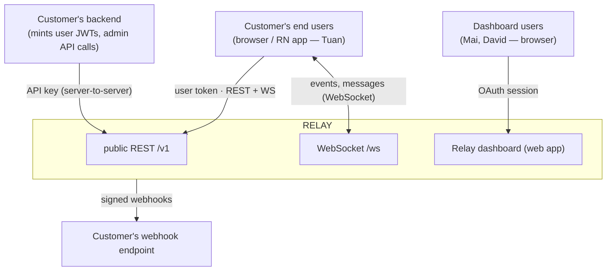
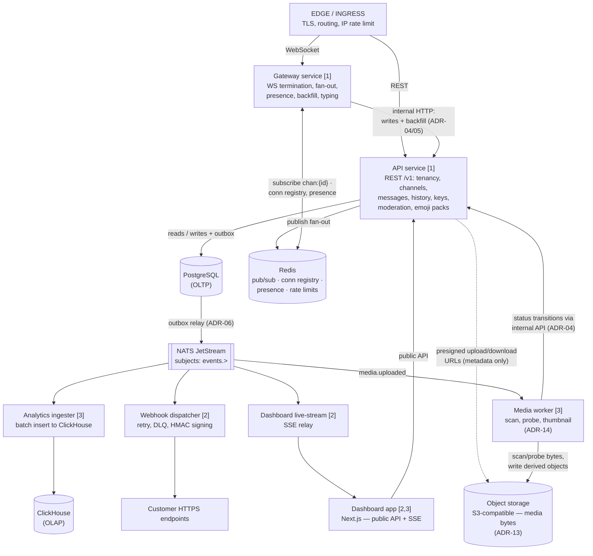
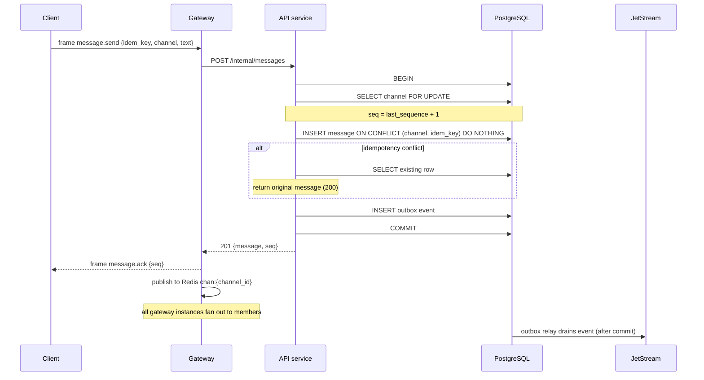
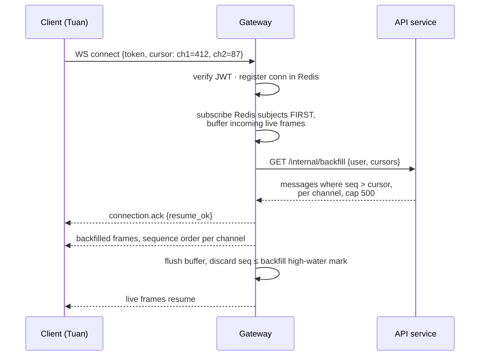
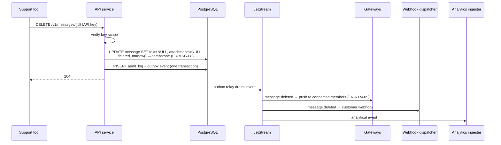
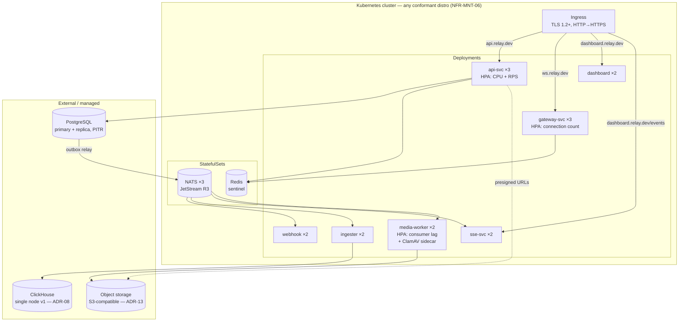

# Relay — Software Architecture Document

**Version:** 1.1 (draft)
**Status:** For review
**Companion documents:** `01-product-vision.md` · `02-personas.md` · `03-journey-map.md` · `04-srs.md`
**Structure:** views-based (C4-influenced), with Architecture Decision Records

---

## Table of contents

1. [Introduction](#1-introduction)
2. [Architectural drivers](#2-architectural-drivers)
3. [Context view](#3-context-view)
4. [Service view](#4-service-view)
5. [Runtime view — key scenarios](#5-runtime-view)
6. [Data view](#6-data-view)
7. [Deployment view](#7-deployment-view)
8. [Cross-cutting concerns](#8-cross-cutting-concerns)
9. [Architecture Decision Records](#9-architecture-decision-records)
10. [Risks and technical debt register](#10-risks-and-technical-debt-register)

---

## 1. Introduction

### 1.1 Purpose

This document describes the architecture of Relay: the services, their responsibilities and
interactions, the data model, the deployment topology, and — most importantly — the
*decisions* and their rationale. Where the SRS says *what* the system shall do, this
document says *how*, and defends the choices against alternatives.

### 1.2 Scope

Covers all four delivery phases of the SRS. Phase-specific elements are marked. The SDK's
internal design is summarised only where it constrains the server (protocol semantics);
its full design is deferred to an SDK design note.

### 1.3 How to read this document

Sections 3–7 are descriptive views. Section 9 (ADRs) contains the reasoning; every
non-obvious choice in the views links to an ADR. If reviewing, read §2 and §9 first — the
rest follows from them.

### 1.4 Conventions

Requirement references use SRS identifiers (`FR-MSG-04`, `NFR-REL-02`). Decisions are
numbered `ADR-nn` and are immutable once accepted; superseding requires a new ADR.

---

## 2. Architectural drivers

The handful of requirements that actually shape the architecture. Everything else is
implementation.

| # | Driver | Source | Architectural consequence |
|---|---|---|---|
| D1 | **No acknowledged message may be lost** | FR-MSG-05/06, NFR-REL-02 | Ack only after durable commit; ordering and persistence in one transactional store |
| D2 | **Correct delivery across gateway instances, no sticky sessions** | FR-RTM-02, CON-02, NFR-SCL-02 | A pub/sub fabric between gateways; connection registry outside instance memory |
| D3 | **Reconnect must resume exactly — no loss, no duplicates** | FR-RTM-03, FR-MSG-04, Tuan's journey | Server-assigned per-channel sequences; idempotency keys enforced at the storage layer |
| D4 | **Tenant isolation is a correctness property** | FR-TEN-05/06, NFR-SEC-09 | Tenant ID threaded through every layer; enforced in data access, not in handlers |
| D5 | **Analytics must never touch the operational path** | CON-01, FR-ANL-02/03, NFR-REL-05 | Fire-and-forget event emission to a durable queue; ClickHouse strictly downstream |
| D6 | **Webhooks must not block delivery** | FR-WHK-05 | Webhook dispatch consumes from the same queue, fully asynchronous |
| D7 | **10 min to first message** | NFR-USE-01, journey Stage 4 | Dev-mode token endpoint; zero-config defaults; dashboard live stream fed from the event queue |
| D8 | **One engineer must be able to run and reason about it** | Portfolio reality; NFR-MNT-03 | Few services with sharp boundaries, not many with fuzzy ones; boring technology |

D8 deserves emphasis. The correct number of services is the smallest number that still
demonstrates real distributed-systems boundaries. Resume-driven microservice sprawl —
fifteen services where five suffice — is itself an architectural smell, and reviewers know it.

---

## 3. Context view



Three trust domains, three credential types:

| Caller | Credential | May do |
|---|---|---|
| Customer backend | API key (`rk_live_…`) | Everything within its environment |
| End-user client | User JWT (customer-signed) | Act as one user: send, read own channels, presence |
| Dashboard user | Session (OAuth) | Manage org, view analytics; no message-send path |

The customer's backend is the trust anchor (SRS §2.1): Relay verifies JWTs with the
environment's signing secret but never authenticates end users itself (CON-06, ASM-01).

---

## 4. Service view

Six deployable services, one queue, three datastores. Phase in brackets.



### 4.1 Service responsibilities

**API service** `[Phase 1]`
Owns all REST semantics: tenancy, auth verification, channels, membership, message write
path, history reads, moderation, keys, and — from Phase 3 — emoji pack management, the
user-facing pack catalog (browse/search/install), and resolution-map assembly on message
reads (→ ADR-11, ADR-12). Stateless. The *only* service that writes to
PostgreSQL — a deliberate single-writer discipline that keeps invariants (sequence
assignment, idempotency, isolation) in one codebase (→ ADR-04). Emits an event to the
queue after every state change.

**Gateway service** `[Phase 1]`
Terminates WebSockets. Validates the JWT on connect, registers the connection in Redis
(`conn:{env}:{user}` → instance ID, TTL-refreshed), subscribes to the Redis pub/sub
subjects for the user's channels, pushes frames. Handles resume: on connect-with-cursor it
reads backfill *through the API service's internal history endpoint*, not from Postgres
directly (single-writer/single-reader discipline, → ADR-04). Sends message frames received
from clients to the API service over internal HTTP — the gateway never writes to the
database (→ ADR-05).

**Webhook dispatcher** `[Phase 2]`
Consumes `events.>` from JetStream with a durable consumer per environment shard. Filters
by endpoint subscriptions, signs (HMAC, FR-WHK-02), posts, retries on the FR-WHK-03
schedule using JetStream redelivery + a scheduled-retry stream, dead-letters after six
attempts. Records every attempt as an analytical event (FR-WHK-06).

**Analytics ingester** `[Phase 3]`
Consumes everything, buffers, batch-inserts to ClickHouse every 2 s or 10k rows (DR-11).
Deliberately dumb: no transformation beyond shaping, no business logic. If ClickHouse is
down it stops consuming and the stream absorbs the backlog (NFR-REL-05, 24 h retention).

**Media worker** `[Phase 3]`
Consumes `media.uploaded` events. Fetches the object, verifies size/type against the
declaration (FR-MED-03), virus-scans (ClamAV sidecar), probes dimensions/duration,
generates thumbnails and poster frames (FR-MED-05), writes derived objects, then
transitions `pending → ready | rejected` via an internal API endpoint — never touching
Postgres directly, per ADR-04. The only Relay component that ever reads media bytes, and
it does so off the request path entirely (→ ADR-14). Scales on JetStream consumer lag;
CPU-bound (scanning, image ops), so it is the one service where ADR-01's worker-thread
posture matters from day one.

**Dashboard live-stream service** `[Phase 2]`
Thin SSE bridge: subscribes to a tenant's events on the queue, relays to the dashboard
browser session. Exists so the dashboard's live view (FR-DSH-02, driver D7) needs no
WebSocket infrastructure of its own and no polling.

**Dashboard app** `[Phases 2–3]`
Next.js. Consumes the public API (EIR-DSH-02) plus the SSE stream and internal billing
endpoints. Server-side sessions via OAuth (FR-TEN-01).

### 4.2 What is deliberately *not* a separate service

| Candidate | Why it stays merged | Revisit when |
|---|---|---|
| "User service", "Channel service" | Same datastore, same transactions, same team. Splitting would turn local transactions into distributed ones for zero scaling benefit — users and channels do not scale independently of messages. | Never, realistically |
| "Auth service" | JWT verification is a library concern (a middleware verifying HS256 with the env secret). A network hop per request to verify a token is pure latency. | If asymmetric multi-issuer auth arrives |
| "Presence service" | Presence is connection state, which lives in the gateway + Redis already. | If presence fan-out dominates gateway CPU (see Open Q3, SRS) |
| Rate limiter | Redis token buckets called in-process from API and gateway. | If limits need to be enforced at edge before TLS termination |

This table is the answer to "why only six services?" — each merge is a decision with a
stated reversal condition, which is more defensible than either extreme.

---

## 5. Runtime view

Three scenarios, chosen because they *are* the journeys: Tuan's send-through-a-tunnel
(Phase 1 exit criterion), the cross-instance delivery that makes it work, and Priya's
moderation action.

### 5.1 Message send with idempotency (D1, D3)



Decisions visible here:
- **Ack after commit, never before** (FR-MSG-05). The Redis fan-out happens after the ack;
  a recipient may see the message milliseconds after the sender's ack, never before durability.
- **Idempotency at the storage layer** via partial unique index (DR-03), not application
  memory — it survives restarts and works across instances (FR-MSG-04).
- **Sequence assignment under row lock** on the channel (DR-04, → ADR-03). Contention scope
  is one channel; busy channels serialise their own sends, which is precisely the ordering
  guarantee FR-MSG-03 requires.
- **Event publication via transactional outbox** (→ ADR-06): the event row commits with the
  message; a relay drains the outbox to JetStream. Publish-after-commit without the outbox
  would silently drop events on a crash in the gap — and metering (FR-ANL-06) would drift.

### 5.2 Cross-instance delivery and Tuan's resume (D2, D3)

Normal delivery: gateway instances all subscribe to Redis pub/sub subject
`chan:{channel_id}` for channels their connected users belong to. The publishing side is
instance-agnostic — no registry lookup on the hot path, no sticky routing (FR-RTM-02).

Resume, per Tuan's journey Stage 3:



**The subtle bug this design closes:** subscribe-then-backfill can deliver a live frame
that is also in the backfill (duplicate); backfill-then-subscribe can drop a message that
lands in the gap. The gateway subscribes first, buffers live frames, serves backfill, then
flushes the buffer discarding anything with `seq ≤` the backfill's high-water mark.
Sequence numbers make the deduplication trivial — which is a large part of why they exist
(→ ADR-03). Backfill beyond 500 messages per channel returns `truncated: true` and the
client refetches history instead (FR-RTM-04).

### 5.3 Priya's moderation delete (journey 3, stage 5)



One write path serves four consumers — Priya's real-time removal, the audit trail
(FR-MOD-03), the customer's webhook, and metering — without any of them coupling to the
others. This scenario is the clearest illustration of why the outbox/queue spine exists.

---

## 6. Data view

### 6.1 PostgreSQL — operational schema (core tables)

```sql
CREATE TABLE environments (
    id              UUID PRIMARY KEY,
    application_id  UUID NOT NULL REFERENCES applications(id),
    kind            TEXT NOT NULL CHECK (kind IN ('development','production')),
    signing_secret  TEXT NOT NULL,          -- envelope-encrypted (NFR-SEC-02)
    retention_days  INT,
    quota_config    JSONB NOT NULL DEFAULT '{}'
);

CREATE TABLE users (
    id              UUID PRIMARY KEY,
    environment_id  UUID NOT NULL REFERENCES environments(id),
    external_id     TEXT NOT NULL,
    display_name    TEXT,
    avatar_url      TEXT,
    metadata        JSONB NOT NULL DEFAULT '{}',
    banned_at       TIMESTAMPTZ,
    UNIQUE (environment_id, external_id)                  -- DR-02
);

CREATE TABLE channels (
    id              UUID PRIMARY KEY,
    environment_id  UUID NOT NULL REFERENCES environments(id),
    external_id     TEXT NOT NULL,
    type            TEXT NOT NULL CHECK (type IN ('public','private')),
    name            TEXT,
    metadata        JSONB NOT NULL DEFAULT '{}',
    last_sequence   BIGINT NOT NULL DEFAULT 0,             -- ADR-03
    archived_at     TIMESTAMPTZ,
    UNIQUE (environment_id, external_id)                   -- DR-02
);

CREATE TABLE messages (
    id              UUID PRIMARY KEY,
    channel_id      UUID NOT NULL REFERENCES channels(id),
    sequence        BIGINT NOT NULL,
    user_id         UUID REFERENCES users(id),
    text            TEXT,                                   -- NULL ⇒ tombstone
    metadata        JSONB NOT NULL DEFAULT '{}',
    attachments     JSONB,
    idempotency_key TEXT,
    created_at      TIMESTAMPTZ NOT NULL DEFAULT now(),
    edited_at       TIMESTAMPTZ,
    deleted_at      TIMESTAMPTZ,
    UNIQUE (channel_id, sequence)                           -- DR-01
);
CREATE UNIQUE INDEX messages_idem
    ON messages (channel_id, idempotency_key)
    WHERE idempotency_key IS NOT NULL;                      -- DR-03

CREATE TABLE message_edits (
    message_id  UUID NOT NULL REFERENCES messages(id),
    edited_at   TIMESTAMPTZ NOT NULL,
    prior_text  TEXT NOT NULL,                              -- FR-MSG-07
    PRIMARY KEY (message_id, edited_at)
);

CREATE TABLE outbox (
    id          BIGSERIAL PRIMARY KEY,
    subject     TEXT NOT NULL,             -- e.g. events.msg.created.{env}
    payload     JSONB NOT NULL,
    created_at  TIMESTAMPTZ NOT NULL DEFAULT now(),
    published_at TIMESTAMPTZ                                -- ADR-06
);

CREATE TABLE emoji_packs (
    id              UUID PRIMARY KEY,
    environment_id  UUID NOT NULL REFERENCES environments(id),
    external_id     TEXT NOT NULL,
    name            TEXT NOT NULL,
    description     TEXT,
    cover_url       TEXT,
    visibility      TEXT NOT NULL DEFAULT 'listed'
                    CHECK (visibility IN ('listed','unlisted')),
    emoji_version   BIGINT NOT NULL DEFAULT 0,              -- DR-13, ADR-12
    deleted_at      TIMESTAMPTZ,
    UNIQUE (environment_id, external_id)
);

CREATE TABLE emojis (
    id          UUID PRIMARY KEY,
    pack_id     UUID NOT NULL REFERENCES emoji_packs(id),
    environment_id UUID NOT NULL,          -- denormalised for the unique index
    shortcode   TEXT NOT NULL CHECK (shortcode ~ '^[a-z0-9_]{2,64}$'),
    image_url   TEXT NOT NULL,
    tags        TEXT[] NOT NULL DEFAULT '{}',
    deleted_at  TIMESTAMPTZ
);
CREATE UNIQUE INDEX emojis_shortcode
    ON emojis (environment_id, shortcode)
    WHERE deleted_at IS NULL;                               -- DR-12

CREATE TABLE user_emoji_packs (
    user_id      UUID NOT NULL REFERENCES users(id),
    pack_id      UUID NOT NULL REFERENCES emoji_packs(id),
    installed_at TIMESTAMPTZ NOT NULL DEFAULT now(),
    PRIMARY KEY (user_id, pack_id)                          -- FR-EMJ-07
);

CREATE TABLE media_objects (
    id               UUID PRIMARY KEY,                      -- doubles as object key suffix (DR-15)
    environment_id   UUID NOT NULL REFERENCES environments(id),
    uploader_user_id UUID REFERENCES users(id),
    kind             TEXT NOT NULL CHECK (kind IN ('image','audio','video')),
    mime             TEXT NOT NULL,
    declared_bytes   BIGINT NOT NULL,
    actual_bytes     BIGINT,
    status           TEXT NOT NULL DEFAULT 'pending'
                     CHECK (status IN ('pending','ready','rejected')),
    probe            JSONB,                                 -- dims / duration
    created_at       TIMESTAMPTZ NOT NULL DEFAULT now(),
    deleted_at       TIMESTAMPTZ
);
CREATE INDEX media_unreferenced
    ON media_objects (created_at)
    WHERE status = 'pending';                               -- the 24 h reaper's scan (FR-MED-10)
```

**Hot-path indexes:** history pagination (FR-MSG-09) is a pure index-order scan over
`(channel_id, sequence)` — the composite index's leftmost-prefix behaviour is exactly what
cursor pagination wants. That ordering is already supplied by DR-01's
`UNIQUE (channel_id, sequence)`, which the planner walks **backward** for newest-first
pages; a separate `DESC` index is therefore not created. `members (user_id, channel_id)`
serves the resume path's "which channels am I in".

> **Amended 2026-08-02 (v1.1).** This section previously specified a dedicated
> `messages (channel_id, sequence DESC)` index. Measured against 50,000 rows, the planner
> ignored it in favour of a backward scan of DR-01's unique index, and dropping it changed
> neither the plan nor the cost estimate (`0.41..5.04` either way). A btree is bidirectional,
> so a `DESC` twin of an existing `ASC` index adds no ordering — it only adds write
> amplification on the send path and storage. Mixed-direction *multi-column* ordering would
> justify one; this query orders by a single column after an equality predicate, so it never
> can. The index was created by the schema chapter and removed by a forward-only migration in
> the pagination chapter, where the evidence appeared.

**Isolation enforcement (D4):** every query goes through a repository layer whose
constructors *require* an `environment_id`; raw connection access is lint-forbidden outside
that layer. The cross-tenant test suite (NFR-SEC-09) attacks every endpoint with foreign
IDs on every build.

**Growth management:** `messages` is the only unbounded table. Partitioning by
`created_at` (monthly, `pg_partman`) keeps retention deletion (FR-MOD-06) as partition
drops rather than bulk DELETEs. Under ASM-04 (≤10 M messages/day) this holds to v2.

### 6.2 ClickHouse — analytical schema (representative table)

```sql
CREATE TABLE message_events (
    environment_id  UUID,
    channel_id      UUID,
    user_id         UUID,
    ts              DateTime64(3, 'UTC'),
    event           LowCardinality(String),   -- created|edited|deleted
    text_length     UInt32,
    attachment_count UInt8,
    delivery_latency_ms UInt32
)
ENGINE = MergeTree
PARTITION BY toYYYYMM(ts)                      -- DR-07
ORDER BY (environment_id, ts)                  -- tenant-scoped range scans
TTL ts + INTERVAL 90 DAY;                      -- DR-09

CREATE MATERIALIZED VIEW daily_usage
ENGINE = SummingMergeTree
PARTITION BY toYYYYMM(day)
ORDER BY (environment_id, day)
AS SELECT
    environment_id,
    toDate(ts)            AS day,
    count()               AS messages,
    uniqState(user_id)    AS active_users_state
FROM message_events
WHERE event = 'created'
GROUP BY environment_id, day;                  -- DR-10: billing never scans raw events
```

No message text anywhere in this store (DR-08 / FR-ANL-11) — the compliance erasure
endpoint (FR-MOD-04) deletes analytical rows by `user_id` mutation, which is tolerable
precisely because it is rare and content-free.

A fifth table, `emoji_events` (DR-14), records emoji usage as `(environment_id, ts, kind,
identifier, pack_id)` with the same partitioning and TTL. It deliberately omits `channel_id`
and `user_id`: per-tenant-per-day aggregates (FR-EMJ-11) need neither, and omitting them
keeps the table outside the scope of the compliance-erasure mutation entirely — an
aggregate that cannot identify a person needs no erasing.

### 6.3 Redis — ephemeral state only

| Key pattern | Purpose | TTL |
|---|---|---|
| `conn:{env}:{user}` → set of instance IDs | Connection registry (FR-RTM-09) | 60 s, heartbeat-refreshed |
| `presence:{env}:{user}` | Presence with 30 s grace (FR-RTM-06) | 30 s |
| `rl:{env}:{bucket}` | Token buckets (FR-RTL-01) | window |
| `emoji:{env}:{version}` → shortcode→URL map | Resolution-map cache (→ ADR-12) | 24 h, version-keyed |
| pub/sub `chan:{channel_id}` | Fan-out fabric (D2) | — |

**Nothing in Redis is a source of truth.** Total Redis loss ⇒ all clients reconnect and
resume from cursors; no data loss (NFR-REL-04 analysis depends on this property).

---

## 7. Deployment view



Local development (NFR-MNT-03): `docker-compose up` — every service plus postgres, nats,
redis, clickhouse, and MinIO standing in for object storage, with a seeded demo tenant.

**Gateway drain on deploy (NFR-REL-03):** on SIGTERM the gateway stops accepting
connections, sends a `server.shutdown` frame with a jittered reconnect hint, waits up to
30 s, closes with code `4009`. Clients reconnect to surviving instances and resume by
cursor — a deploy costs each client exactly one reconnection cycle, which is the SRS bound.

**Scaling triggers:** gateway on connection count (NFR-SCL-01 sets 10k/instance as the
budget — *measure before trusting*, see risk R2); API on RPS; ingester on JetStream
consumer lag; webhook dispatcher on stream depth.

---

## 8. Cross-cutting concerns

**Security.** Three credential middlewares (API key hash-lookup with 5 s revocation cache
→ FR-AUT-05; JWT verification per environment secret; dashboard session). Key rotation is
dual-active by design (FR-AUT-04). Secrets envelope-encrypted at rest; TLS everywhere;
schema validation with unknown-field rejection at the edge of every handler (NFR-SEC-04).

**Observability.** OpenTelemetry SDK in every service; trace context propagated through
JetStream headers so a message's journey — REST ingress → outbox → dispatcher → webhook
attempt — is one trace (NFR-OBS-02, -06). `X-Request-Id` = trace ID, so a customer support
ticket carries its own trace handle. Structured logs with `environment_id` on every line;
Prometheus metrics per NFR-OBS-03; the four golden alerts of NFR-OBS-04.

**Two metrics systems, on purpose.** ClickHouse (FR-ANL) and Prometheus (NFR-OBS) both
hold "metrics," and the duplication is deliberate. ClickHouse is the *product's*
analytics: per-tenant business events answering questions customers ask — usage, metering,
request logs, delivery percentiles in *their* dashboard. Prometheus is *operational*
observability: pre-aggregated time series about the system itself, answering questions the
operator asks and feeding the alerts that page someone. They cannot be consolidated,
because the observer must not share fate with the observed: ClickHouse outage is a row in
the failure matrix above, and the entire analytical path is *designed to be droppable*
(D5) — alerting cannot live on a component whose failure the architecture is built to
tolerate. Prometheus's pull model scrapes `/metrics` directly from each service, touching
none of the data infrastructure, so it keeps working precisely when the event pipeline
does not. (This is ADR-09's observer-isolation argument applied one level up.) Secondary
reasons: the data shapes differ (aggregated series + PromQL alert expressions vs. raw
high-cardinality events), and the Kubernetes deployment (§7) makes Prometheus the ambient
standard — every StatefulSet ships an exporter. Where one measurement serves both
audiences (delivery latency: operator alerts *and* FR-ANL-10's customer percentiles), it
is recorded twice, once per store — correct, not wasteful. A single ClickHouse-backed
observability stack is a defensible design elsewhere (SigNoz et al.); it loses *here* on
the fate-sharing argument specifically.

**Backpressure, end to end.** Client → gateway: per-connection send window (unacked frames
cap). Gateway → API: bounded internal HTTP pool; on saturation, reject sends with a
retryable error rather than queueing unboundedly. Outbox → JetStream: relay lag alarmed.
JetStream → consumers: pull consumers with explicit ack; slow consumers grow the stream,
which is the design (D5), bounded by 24 h retention (NFR-REL-08).

**Failure matrix (summary of the analysis behind NFR-REL):**

| Failure | Blast radius | Recovery |
|---|---|---|
| Gateway instance dies | Its connections only | Clients reconnect + resume; zero loss (Redis registry TTLs out) |
| Redis lost | Presence + fan-out pause | Gateways buffer briefly, reconnect clients; Postgres unaffected |
| JetStream lost | Webhooks, analytics, live dashboard pause | Outbox accumulates in Postgres; relay drains on recovery — *this is why the outbox is in Postgres, not fire-and-forget* |
| ClickHouse lost | Dashboards stale | Ingester pauses; stream absorbs 24 h (NFR-REL-05) |
| Object storage lost | Media uploads/downloads fail; text messaging unaffected | Upload slots return a specific error; attachments render as temporarily unavailable; no Relay-side state to recover — storage provider's durability is the recovery |
| Postgres lost | Full write outage | The one honest SPOF: managed HA + PITR (NFR-REL-06/07); reads could survive on replica but v1 does not attempt write continuity |

**Scaling behaviour by scenario.** The failure matrix answers "what breaks?"; this answers
"what saturates?". Each load scenario stresses a different component, and each service
deliberately scales on a different signal (§7).

*S1 — connection growth (many users online, mostly idle).* Pure gateway load: socket
memory, heartbeats, registry TTL refreshes. Linear horizontal scaling on connection count;
no sticky routing (D2) means new instances absorb load immediately. Idle connections cost
Postgres nothing. The cheapest dimension to scale — and the reason the per-instance
connection budget (NFR-SCL-01, risk R2) must be measured first: it is the fleet-sizing
formula.

*S2 — aggregate message throughput, spread across channels.* Two regimes: horizontal at the
stateless API tier until Postgres saturates, then vertical at Postgres. Per-channel locks
(ADR-03) do not contend across channels, so they are irrelevant here. A tuned single
primary clears ASM-04 (10 M msg/day ≈ 115/s average) and the 1,000 msg/s target
(NFR-SCL-03) with roughly an order of magnitude of headroom. Beyond that lies tenant
sharding — a v2 redesign, deliberately out of scope. **This is the architecture's one true
wall, named as R1.**

*S3 — one hot channel (1,000 members, rapid sends).* The sequence lock serialises that
channel's writes, but a row-lock cycle is sub-millisecond — hundreds of msg/s in one
channel, faster than humans converse, and serialisation *is* the requirement (FR-MSG-03).
The real cost is fan-out amplification: 100 msg/s × 1,000 members = 100,000 frames/s of
gateway egress. Redis publishes once per message; each gateway multiplies to its local
sockets, so gateway egress bandwidth and event-loop time saturate first, never the
database. Response: more gateway instances (thinner member spread); revisit trigger:
per-socket frame batching if hot channels become the norm. FR-CHN-07's 1,000-member cap
exists to bound this amplification factor.

*S4 — reconnection storm (deploy, or network blip recovery).* Tuan's car park at fleet
scale, and the likeliest real incident. The herd hits JWT verification (gateway CPU), the
registry (Redis write burst), and — the expensive part — backfill reads fanning through
the API into Postgres. Layered defence: SDK jittered backoff (FR-SDK-04) spreads the herd;
the deploy drain protocol (§7) pre-spreads it; the 500-message backfill cap (FR-RTM-04)
bounds per-user read cost. If backfill still dominates, ADR-04's stated escape hatch fires:
route gateway backfill to a read replica — reads do not threaten invariants. Reconnection
is a *read*-scaling problem, and reads have a cheap answer (replicas) that writes do not.

*S5 — webhook trouble (event burst, or one slow customer endpoint).* The dispatcher scales
on stream depth, but the governing property is isolation, not throughput: per-endpoint
concurrency limits stop one endpoint timing out at 10 s from occupying the worker pool.
The stream absorbs backlog (D5/D6 by design), retries decay to the 2 h tier, auto-disable
(FR-WHK-07) amputates dead endpoints. Nothing on this path can touch message delivery —
the queue is a one-way valve.

*S6 — analytics load (event bursts, heavy dashboard queries).* The ingester scales on
consumer lag, and batching means more throughput arrives as *bigger batches* before it
means more instances — which is what ClickHouse prefers. Query load lands on a single node
(ADR-08) that scales vertically for a long time because rollups (DR-10) keep billing off
the raw tables. Total failure of this path degrades to stale dashboards and a draining
backlog; messaging never feels it.

*S7 — tenant growth (100 → 10,000 customers).* Nearly free: tenancy is rows, not
infrastructure — no per-tenant processes, topics, or schemas. What does scale with tenant
count: rate-limit key cardinality (trivial), webhook endpoint count (dispatcher shards by
environment), and noisy-neighbour pressure, which quotas (FR-RTL) contain. The watch item
is *skew*: one tenant at 50% of traffic is fine for the shared-schema model until their
retention deletes (R6) or exports bully the shared tables.

*S8 — media-heavy tenants (photo/voice-note dominant traffic).* The design's payoff
scenario: bytes flow client → object storage and storage → client directly (ADR-13), so
media volume stresses Relay only at three metadata points — slot issuance and signed-URL
minting on the API service (a hash + HMAC, thousands/s per instance), scan throughput on
the media worker (CPU-bound; scales horizontally on consumer lag, and a backlog degrades
only time-to-`ready`, never message delivery per FR-MED design note 1), and the storage
bill (metered per tenant, FR-MED-12, with DR-17's inventory reconciliation as the
tripwire). Object-storage bandwidth itself is the provider's scaling problem — which is
precisely why ADR-13 buys it rather than builds it.

**Saturation summary:**

| Component | Scales on | Regime | Real ceiling |
|---|---|---|---|
| Gateway | connection count | horizontal, linear | fan-out amplification (S3) |
| API service | RPS / CPU | horizontal | Postgres write throughput behind it |
| PostgreSQL | — | vertical, then shard | **the wall (R1)** — ~10× above v1 targets |
| Redis | pub/sub throughput | vertical; shard by subject if ever | far beyond v1 scale |
| Webhook dispatcher | stream depth | horizontal | customer endpoint slowness (isolated, not fixed) |
| Analytics ingester | consumer lag | horizontal + larger batches | ClickHouse insert rate (huge) |
| Media worker | consumer lag | horizontal | scan CPU; backlog degrades time-to-ready only (S8) |
| Object storage | — | provider's problem (ADR-13) | the invoice, not the throughput |
| SSE / dashboard | sessions | horizontal | none relevant |

The design converts every scaling problem into either "add stateless instances" (cheap,
automatic) or "Postgres writes" (the single named, bounded, monitored wall) — a clarity
bought by refusing distributed writes in v1. A trade, not a triumph; but one wall with a
name beats three without.

---

## 9. Architecture Decision Records

> Each ADR below is deliberately terse. The full rationale — problem framing, all options
> considered, quantitative analysis, and consequences — lives in the companion document
> `06-adr-deep-dives.md`, one deep dive per ADR.

### ADR-01 — Runtime: TypeScript/Node.js for all services
**Status:** accepted · **Drivers:** D7, D8

One language across services, SDK, and dashboard; the SDK (FR-SDK-01) must be JS anyway,
and sharing protocol types between server and SDK eliminates an entire class of drift bugs.
Node's event-loop model suits I/O-bound gateway work. **Trade-off accepted:** CPU-bound
work (HMAC signing at volume) needs care; NFR-SCL-01's 10k connections/instance must be
validated early (→ R2). **Rejected:** Go (better gateway fit, but splits the codebase into
two languages for a solo builder); a polyglot showcase (violates D8 — depth over surface).

### ADR-02 — Queue: NATS JetStream over Kafka
**Status:** accepted · **Drivers:** D5, D6, D8

JetStream provides durable streams, consumer groups, redelivery, and DLQ-adjacent patterns
at a fraction of Kafka's operational mass, and doubles as the transport the SSE service
subscribes to. Volume ceiling (ASM-04, NFR-SCL-05: 10k events/s) is comfortably within
JetStream's envelope. **Trade-off:** weaker ecosystem for exactly-once sinks; mitigated
because the only strict consumer (metering) reconciles daily against Postgres (FR-ANL-06).
**Rejected:** Kafka (operational overkill at this scale; the reconciliation job is needed
regardless); Redis Streams (couples the durability spine to the ephemeral-state store —
one Redis incident would then have two blast radii).

### ADR-03 — Ordering: per-channel sequence via `last_sequence` row lock
**Status:** accepted · resolves SRS Open Question 1 · **Drivers:** D1, D3

Per-channel sequences, assigned by incrementing `channels.last_sequence` under
`SELECT … FOR UPDATE` in the message-insert transaction. Contention is scoped to a single
channel — and serialising a channel's writes *is the requirement* (FR-MSG-03), so the lock
is not a cost, it is the mechanism. Resume cursors are per-channel maps `{channel_id: seq}`,
capped in practice by FR-RTM-04's truncation. **Rejected:** per-tenant sequence (single
hot row per tenant — a real bottleneck for zero benefit at v1 scale); Postgres sequences
per channel (unbounded object count, non-transactional gaps break dedup reasoning);
Snowflake-style IDs (globally unique but not gap-free per channel, which complicates the
client's "did I miss something?" logic).

### ADR-04 — Single writer: only the API service touches PostgreSQL
**Status:** accepted · **Drivers:** D1, D4, D8

All invariants — sequence assignment, idempotency, tenant scoping, tombstone semantics —
live in one codebase behind one repository layer. The gateway calls internal HTTP for
writes *and* backfill reads. **Trade-off:** one extra intra-cluster hop on the send path
(~1–2 ms) and on resume; accepted against the alternative of duplicating isolation logic in
two services and testing it twice. **Revisit:** if backfill volume ever dominates API-service
load, grant the gateway a read-only replica path — reads don't threaten invariants.

### ADR-05 — Sends travel through the WebSocket, writes through the API
**Status:** accepted · **Drivers:** D3, journey 4

Clients send over the socket they already hold (lower latency, and the SDK's offline queue
flushes through one channel), but the gateway forwards to the API service rather than
writing. REST send (FR-MSG-13) uses the identical API path — one write path, two entrances.
**Rejected:** REST-only sends (breaks the offline-flush ordering story and doubles
connection overhead on mobile); gateway-direct DB writes (violates ADR-04).

### ADR-06 — Transactional outbox between Postgres and JetStream
**Status:** accepted · **Drivers:** D1, D5, FR-ANL-06

State change and its event commit atomically; a relay (polling, `FOR UPDATE SKIP LOCKED`,
batch-publish, mark published) drains to JetStream. At-least-once by design — consumers
dedupe on event `id` (EIR-WHK-04 pushes the same discipline to customers). **Rejected:**
publish-after-commit (drops events on crash in the gap; metering drift would violate
FR-ANL-06 undetectably); CDC/Debezium (operational mass, D8); publish-before-commit
(phantom events, worse).

### ADR-07 — Fan-out fabric: Redis pub/sub, at-most-once, by design
**Status:** accepted · **Drivers:** D2, D3

Live fan-out uses fire-and-forget Redis pub/sub. A dropped pub/sub frame is *not* a lost
message: durability lives in Postgres, and the client's cursor + sequence-gap detection
recovers anything missed (the SDK refetches on gap). This is the architectural payoff of
ADR-03 — once ordering and resume are correct, the fan-out fabric is allowed to be lossy,
and therefore simple and fast. **Rejected:** JetStream for live fan-out (durable, but
per-channel consumer management for ephemeral delivery is heavy machinery to avoid a
problem the cursor already solves); gateway-to-gateway mesh (O(n²) connections, discovery
complexity).

### ADR-08 — ClickHouse single-node in v1, schema designed for cluster
**Status:** accepted · **Drivers:** D5, D8, NFR-SCL-05

One node with backups meets 10k inserts/s and the 2 s/90-day query bound with margin. The
analytical store's unavailability is survivable by design (24 h stream buffer), so HA here
buys little. Partitioning and ORDER BY are already cluster-shaped; moving to a replicated
setup is a data migration, not a redesign. **Rejected:** ClickHouse Cloud from day one
(cost + a cloud dependency against NFR-MNT-06); reusing Postgres for analytics (CON-01
exists precisely to forbid this).

### ADR-09 — Dashboard live view over SSE, not WebSocket
**Status:** accepted · **Drivers:** D7

The dashboard's live stream (FR-DSH-02) is one-directional; SSE gives it with plain HTTP,
automatic reconnection, and zero protocol design. Keeps the real WebSocket gateway
dedicated to end-user traffic with its own scaling signal. **Rejected:** sharing the
gateway (couples dashboard load to end-user delivery paths — the one thing that must not
degrade); polling (2 s latency bound of FR-DSH-02 makes it ugly).

### ADR-10 — Presence in Redis with TTL, no dedicated service
**Status:** accepted · resolves SRS Open Question 3 (provisionally) · **Drivers:** D8

Presence = connection-registry keys with a 30 s grace TTL (FR-RTM-06); transitions publish
on the affected channels' subjects only (FR-RTM-07). Presence loss (Redis incident) is
cosmetic and self-heals — the correct amount of durability for typing dots and green
circles is none. **Revisit trigger:** presence fan-out exceeding ~30% of gateway publish
volume in load tests.

### ADR-11 — Custom emoji as shortcodes in plain text, with a read-time resolution map
**Status:** accepted · **Drivers:** D1, D3, D8 · implements FR-EMJ-08/10

Message `text` remains a plain string; custom emoji are written as `:shortcode:` and
resolved at *read* time — history and send responses carry a sidecar map
`{shortcode → {image_url, pack_id} | unresolved}` covering shortcodes present in the
payload. **Why:** every invariant the architecture bleeds for — byte-exact storage
(FR-EMJ-01), tombstones, edit history, idempotent retries — is defined over an opaque
string. Structured message entities (an AST of text runs and emoji nodes, Slack-style)
would entangle emoji lifecycle with FR-MSG semantics: what does an edit diff of an entity
tree mean? What does a tombstone preserve? Plain text keeps the write path emoji-ignorant;
the emoji system becomes a pure read-side concern, which is also what makes FR-EMJ-10
trivial — deleting a pack changes future *resolutions*, never stored *messages* (Priya's
journey 3 depends on exactly this). **Trade-off:** literal `:text:` that was never an emoji
may resolve accidentally if a matching shortcode is later created; accepted — the client
fallback and the shortcode grammar make collisions benign. **Rejected:** entity trees
(above); Unicode Private Use Area code points (uninspectable, breaks the "text is honest"
property, hostile to export FR-MOD-05); server-side rendering to image URLs inside text
(mutates content — violates FR-EMJ-01's spirit and Priya's record).

### ADR-12 — Environment-scoped resolution map, cached whole, invalidated by version
**Status:** accepted · **Drivers:** D8, NFR-PRF-03 · implements DR-13

History reads are the hottest read path (NFR-PRF-03: p95 < 100 ms) and now must attach a
resolution map. Per-message shortcode lookups against Postgres would put a join on every
history page. Instead: the *entire* environment's shortcode map is cached in Redis under a
version-stamped key (`emoji:{env}:{version}`, DR-13); any pack mutation bumps
`emoji_version`, making stale keys unreachable rather than requiring explicit invalidation
— the same version-key pattern as CDN cache-busting. Map size is bounded by construction:
FR-EMJ caps at 200 emoji/pack and shortcodes at 64 chars, so even a hundred packs is a
sub-megabyte map, loadable in one round trip and memoised in-process per API instance.
Resolution-map assembly is then a pure in-memory scan of the returned page's text.
**Trade-off:** a pack mutation cold-starts the cache for its environment once; acceptable —
pack edits are rare, reads are constant. **Rejected:** per-message resolution joins (hot
path); pushing resolution to the SDK only (leaves REST-only consumers unresolved and
duplicates logic across clients — the map costs the server almost nothing given the cache).

### ADR-13 — Media bytes never transit Relay compute: presigned direct-to-storage
**Status:** accepted · reverses the v1.0 file-storage exclusion · **Drivers:** D5, D8, NFR-PRF-08

Uploads: the API service validates declaration and quota, records a `pending` row, and
returns a presigned PUT URL; the client uploads straight to S3-compatible storage.
Downloads: signed GET URLs minted at read time, authorised by channel membership
(FR-MED-08), never persisted (DR-16). Relay's services handle metadata only — the original
exclusion's cost argument (bandwidth, CDN, storage ops) is answered by not building any of
it: object storage's durability, bandwidth, and lifecycle rules are bought, not rebuilt.
Tenant-prefixed keys (DR-15) make erasure and export prefix operations. **Trade-off:**
presigned-URL auth is coarser than per-request auth (a leaked signed URL is valid until
expiry — bounded at 1 h, unguessable, and never stored); upload success is observed
asynchronously (the confirm/scan event), not synchronously. **Rejected:** proxied uploads
through the API service (every media byte on Relay's network path — the exact cost the
exclusion feared, now voluntary); public-read bucket with obscure keys (violates
FR-MED-08; membership changes must revoke access, and time-limited URLs are the mechanism).

### ADR-14 — Async scan pipeline gates bytes, never messages
**Status:** accepted · **Drivers:** D5, D6, journey 4 · implements FR-MED-04/06/07

A message may reference `pending` media and ship immediately; recipients render a
placeholder; the media worker's `pending → ready` transition fans out `media.updated` on
the referencing channels. The scan gates *byte delivery* (no signed URL until `ready`),
never *message delivery*. **Why:** the alternative — scan-before-send — puts a 2–10 s
CPU-bound pipeline inside the send path, violating the latency budget (NFR-PRF-01) and
coupling message availability to scanner availability, exactly the coupling D5 exists to
forbid. The state machine mirrors the message state machine the SDK already implements
(`sending/sent/failed` ↔ `pending/ready/rejected`) — one mental model, twice applied.
Rejection is a first-class terminal state rendered explicitly (FR-MED-09): Priya must
distinguish "the upload was rejected" from "the message was deleted." **Trade-off:** a
recipient can see a placeholder for a file that is subsequently rejected — accepted, since
consumer messengers set exactly this expectation. **Rejected:** synchronous scanning
(above); no scanning (hosting unscanned user uploads is a liability no metering revenue
covers); scan-on-first-download (moves the latency to the recipient's tap and re-scans
per CDN miss).

### ADR-15 — API service application framework: NestJS
**Status:** accepted · **Drivers:** D7, D8 · serves EIR-API-04/07, NFR-USE

The API service's REST surface grows to dozens of endpoints across Phases 2–4 (tenancy,
channels, messages, keys, moderation, emoji packs, dashboard reads). NestJS supplies the
module/DI/guard/pipe conventions that keep per-endpoint variance low for a solo builder,
schema validation at the boundary as a framework primitive, uniform error shaping
(EIR-API-04), and generated OpenAPI 3.1 (EIR-API-07) instead of a hand-maintained spec.
**Scope:** the API service only. The gateway stays frameworkless — its work is raw socket
mechanics (resume buffering, backfill ordering), and a framework between that code and the
socket is surface without benefit. Workers remain plain consumers. Isolation is unaffected:
the repository layer (D4) sits beneath the framework, constructed per request with the
authenticated `environment_id` — guards authenticate, the data layer isolates.
**Trade-off:** decorators require a build/transform step, and the dependency tree grows a
DI container; accepted against hand-rolling (and hand-documenting) the same conventions
across the Phase 2–4 surface. **Rejected:** hand-rolled node:http routing (right for a
walking skeleton, quadratic pain at platform scale); bare Express/Fastify (routing without
the validation/OpenAPI/DI conventions this surface needs — Fastify is the named fallback).
**Revisit:** if framework overhead shows up on latency-budget paths (NFR-PRF-01), or if
the abstraction starts fighting a core-loop mechanism the way it would on the gateway.

### ADR-16 — API service data layer: Drizzle over raw pg
**Status:** accepted · **Drivers:** D1, D4, D8 · serves NFR-MNT-02

Repository-layer queries are written with Drizzle: SQL-shaped, fully typed, and — the
deciding test — the core loop's mechanisms are first-class, not escape hatches:
`SELECT … FOR UPDATE` (ADR-03's row lock), `ON CONFLICT DO NOTHING` (DR-03), partial
unique indexes and CHECK constraints expressible in the schema definition. Migrations
remain versioned, forward-only SQL files: drizzle-kit generates them, they are reviewed
and applied as SQL, and the applied SQL — not the TS schema — is what runs; generated
migrations are diffed against this document's §6.1 definitions so the two cannot drift
silently. The repository discipline is unchanged: Drizzle is the query engine *inside*
the layer, never a client handed to handlers; raw SQL islands remain permitted inside the
layer where the builder falls short. **Trade-off:** the schema gains a TS definition
alongside §6.1's SQL — a second artifact to keep honest, checked rather than assumed.
**Rejected:** Prisma (cannot express DR-03's partial unique index in its schema, and lock
semantics exist only as raw escape hatches — the abstraction fails exactly where
correctness lives); TypeORM (weak result typing where NFR-MNT-02 wants confidence;
legacy trajectory); kysely (the closest call — typed SQL with zero schema ownership;
declined for Drizzle's schema-level constraint definitions and relational ergonomics, and
it is the named fallback). **Revisit:** if the TS schema and applied SQL drift in
practice, or if builder coverage forces raw SQL for a majority of new queries — at that
point kysely's schema-free model wins.

### ADR-17 — Monorepo build orchestration: Turborepo
**Status:** accepted · **Drivers:** D8 · serves NFR-MNT-02/03

ADR-15 gives the workspace its first real build step (NestJS's decorators compile), and
Phases 2–4 grow it to six services plus shared packages. Plain `pnpm -r` re-runs every
task in every package on every change; with a build step and a task order (protocol
builds before the services that import it) that cost becomes quadratic exactly where D8
wants it flat. Turborepo runs the existing package scripts through a declared task graph
with content-hash caching: the gate's cost scales with the change, not with the
workspace. **Scope:** a task runner only. pnpm remains the package manager and workspace
protocol; every `turbo run` target is an ordinary package script, so removing Turborepo
degrades to `pnpm -r`, not to a rewrite. Remote caching is deferred until CI exists.
**Trade-off:** a wrong cache is a false green — correctness now depends on `turbo.json`
declaring task inputs and outputs honestly. Accepted with discipline: input/output
declarations are reviewed like code, and tagged checkpoints run clean-cache.
**Rejected:** staying on plain `pnpm -r` scripts (correct until a build step existed;
the wrong default once one does — and it remains the degradation path); Nx (more capable,
but its plugin ecosystem, daemon, and generators are surface a solo builder doesn't
need — the named fallback if Turborepo's caching proves untrustworthy); Bazel (a build
team's tool, priced in a currency D8 doesn't hold). **Revisit:** if stale-cache incidents
survive the input-declaration discipline, or if the task graph starts encoding knowledge
that belongs in package.json dependencies.

---

## 10. Risks and technical debt register

| # | Risk / debt | Exposure | Mitigation / trigger |
|---|---|---|---|
| R1 | **Postgres is the single point of failure** for writes | Full write outage (see failure matrix) | Accepted for v1: managed HA, PITR (NFR-REL-06/07). Trigger for revisit: availability SLO tightens past 99.9% |
| R2 | **Node gateway connection ceiling unvalidated** — NFR-SCL-01's 10k/instance is a budget, not a measurement | Architecture sizing wrong by ×2–5 | Load-test in Phase 1 week 1, before any dependent decision hardens (this is the SAD's single most urgent action item) |
| R3 | **Channel-list subscription churn** — a user in hundreds of channels makes connect/subscribe expensive | Resume latency (NFR-PRF-05) degrades for power users | Cap channels-per-user in v1 (matches FR-CHN-07 spirit); wildcard-subject scheme sketched if needed |
| R4 | **Outbox relay is a serial choke point** | Event lag under burst | Relay is horizontally scalable via `SKIP LOCKED` batching; alarm on outbox depth (NFR-OBS-04) |
| R5 | **At-least-once everywhere requires consumer discipline** | A future consumer forgets to dedupe → double webhooks / double metering | Consumer template with dedup built in; reconciliation job (FR-ANL-06) as the tripwire |
| R6 | **Retention deletion vs. partitioning** — per-environment retention (FR-MOD-06) doesn't align with monthly partitions | Bulk deletes on mixed partitions | v1: row deletes off-peak per environment; debt noted — env-major partitioning if tenants grow large |
| R7 | **Single-language monoculture** (ADR-01) | CPU-bound hot spots have no escape hatch in-language | Isolate HMAC/crypto behind an interface; a Rust/Go sidecar is a contained swap if profiling demands it |
| R8 | **Customer-hosted emoji images** — Relay serves URLs it does not control (FR-EMJ design note 1) | Broken/slow images degrade perceived quality; malicious URL swaps after moderation review alter a record's *appearance* (though never its text) | Document CDN/caching responsibility; resolution map is versioned so Priya's tooling can pin the resolution seen at review time; revisit trigger: emoji images may now optionally use hosted media (ADR-13), which removes this class entirely for customers who opt in |
| R9 | **Hosted media liability surface** — Relay now stores user-uploaded bytes: illegal content, scanner misses, storage-cost runaway | Legal exposure; cost growth decoupled from message volume | Mandatory scan gate (ADR-14) with audit trail; per-kind size caps + per-tenant storage quotas and spend caps (FR-MED-02, FR-RTL-06); DR-17 inventory reconciliation catches metering drift; abuse-report takedown path rides the existing moderation API (FR-MOD-02 + FR-MED-10's unlink-and-reap) |

---

*Every ADR above states its reversal condition or rejected alternatives. If a review
disagrees with a decision, the productive move is to attack the driver, not the choice —
the choices follow from D1–D8 fairly mechanically.*
